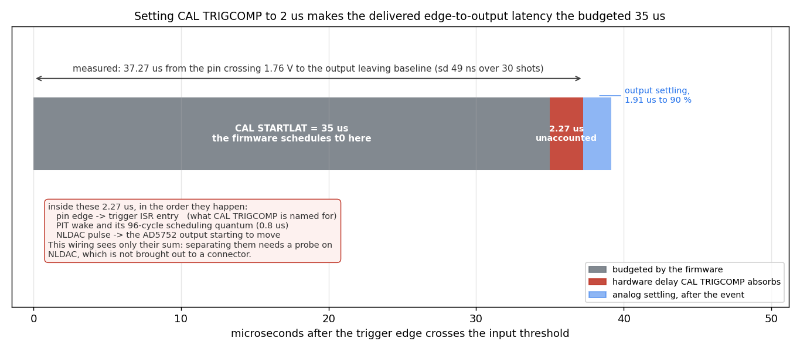
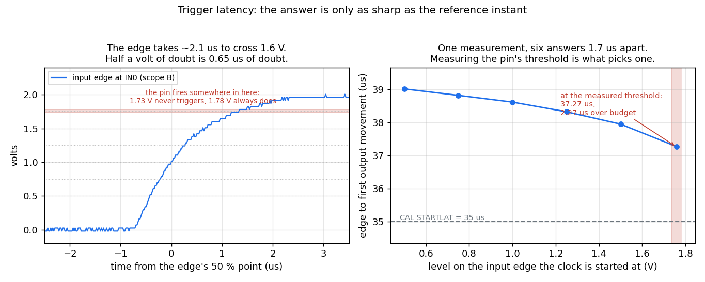
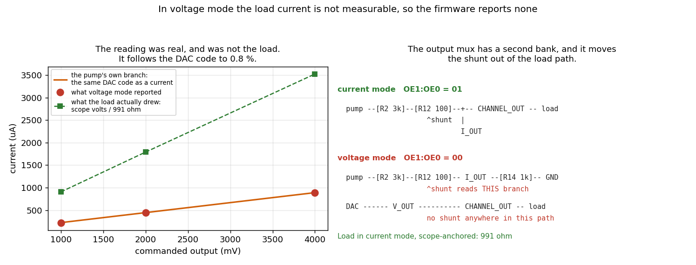

# Bench wiring for the stimjimAWG measurements that are still open

This document describes, from scratch, how to wire a StimJim board and an oscilloscope for each
measurement the `stimjimAWG` firmware still needs, and what to do once it is wired. It assumes
nothing beyond a StimJim running `stimjimAWG`, a two-channel oscilloscope with a signal generator
(a PicoScope 2204A is what the existing scripts drive), a handful of resistors and two LEDs. Every
number quoted as "measured" comes from a Teensy 3.5 at 120 MHz running the register backends.

Four of the firmware's timing budgets used to need an oscilloscope. Three no longer do:
`BENCHDAC`/`BENCHADC`/`BENCHPIT` measure the DAC, ADC and timer costs, `BENCHARM` measures the
cost of arming a train, and `BENCHSETTLE` measures how long after a latch a reading means
anything. What is left needs a scope because it involves an instant the firmware cannot observe —
the physical edge on a trigger pin — or a comparison between two outputs.

**Status.** Configuration A is measured and configuration B is measured (2026-09-08; the numbers
are in its section below, and `tests/device/trigcomp.py` repeats them). Configuration C has not
been run.

Three wiring configurations cover everything below. Configuration A is the bench as it stands and
is the one `tests/device/capture.py` already drives; B and C are changes to it.

---

## Safety and setup, common to all three

- The two channels are isolated from each other and from the USB supply. An oscilloscope is not:
  its channel grounds are common. **Tie the scope ground to exactly one node of the load**, and
  never to two nodes that the StimJim drives independently, or the isolation is defeated through
  the scope.
- Keep the outputs grounded (`M0,3` and `M1,3`, which is the boot state) whenever you are
  changing wiring.
- The 2204A is 8-bit: on the ±10 V range one code is 78 mV. Keep every scope trigger level at
  least 1 V clear of the baseline, or the threshold sits inside the trigger hysteresis and never
  fires.
- Close the PicoScope application before running any script. It holds the USB device exclusively.
- With both scope channels enabled the capture buffer is 3968 samples and the fastest sample
  interval is **20 ns** (timebase 1; 40 ns and slower are also available, and every index the
  driver accepts delivers what it reports — `tests/device/scope_timebase.py` checks that against
  the unit's own AWG). Until 2026-09-08 `pico2000.py` mis-scaled the driver's interval and could
  never select anything faster than 640 ns, which is the floor earlier revisions of this document
  quoted. The buffer is the real constraint: 3968 samples at 20 ns is a 79 µs window, so fine
  resolution and a long window are alternatives.

---

## Configuration A — the load chain (what is on the bench now)

```
PicoScope AWG  ------------------------------> StimJim trigger input IN0

load chain, four nodes in series:

    CH1(+) ---- 1k ---- CH0(+) ---- 1k ---- CH0(-) ---[antiparallel LEDs]--- CH1(-)
      |                    |                   |
   scope B              scope A            scope gnd
```

The two antiparallel LEDs are deliberately different colours — one red, one blue. Their forward
voltages differ by about a volt, so the branch clamps at a different level in each polarity: the
load a positive half of a bipolar pulse sees is not the load the negative half sees. An `S` train
with a positive and a negative stage must read back two *different* clamp levels; a pair of equal
magnitudes would mean the firmware is reporting one stage's value for both.

The chain couples the channels, and the captures show it in both directions. Neither of these is
a fault:

- A CH0 pulse appears on **scope channel B**, because a channel no train drives is *grounded*,
  which ties CH1(+) to CH1(−) and hence to the LED branch. Below the LEDs' turn-on that branch
  carries no current, so scope B simply sits at CH0(+)'s potential; above it the LEDs clamp and
  scope B saturates at +2.2 V one way and −2.9 V the other.
- A CH1 pulse divides down onto **scope channel A**: with CH0 grounded, an 8 V pulse on CH1 reads
  about 0.5 V there.

### What A measures

| Test | Script | Result on this bench |
|---|---|---|
| `S`, `L` and `W` shapes on a real load | `python capture.py shapes` | `figs/stimjim-shape-*.png` |
| Post-trigger delay accuracy | `python capture.py delay` | 2000 µs set → 1999.3 measured; 5000 → 4999.3; 20000 → 19996.0 |
| Engine-to-engine offset | same run | −0.25 µs |
| Same-instant latch contention | same run | −10.1 µs |

The delay is measured differentially, because the AWG wire is not teed to a scope input: one
trigger edge starts a reference pulse on CH1 and the pulse under test on CH0, the scope triggers
on the reference, and the constant engine-to-engine offset is subtracted. That offset is
calibrated at a **500 µs** delay, not at 0 — at 0 the two first latches fall on the same instant
and the second player ISR waits for the first to return, which is the contention figure above and
is absent at every other delay.

---

## Configuration B — trigger edge and output on the scope at the same time

**Measures: the absolute delay from the physical edge at the input pin to the output actually
moving — the quantity `CAL TRIGCOMP` exists to cancel. On the Teensy 3.5 in hand the hardware part
is 2.27 µs and the shot-to-shot spread 41–49 ns. `CAL TRIGCOMP` is now set to 2 and
`CAL STARTLAT` to 20, which delivers 20.26 µs from the edge to the output.**

`tests/device/trigcomp.py` drives the whole of this section: `check` verifies the wiring
connection by connection, `threshold` measures the input pin's own switching level, and `measure`
takes the latency. Read that script's docstring for what each step proves; the rest of this
section is what the numbers turned out to be.

Change from A: tee the AWG output so the scope sees the edge it generates.

```
PicoScope AWG ---+---> StimJim trigger input IN0
                 |
                 +---> scope channel B          (the edge itself)

    CH0(+) ---- 1k ---- CH0(-)
      |                    |
   scope A             scope gnd

CH1 unused; leave it grounded (M1,3).
```

The 1 kΩ across CH0 is a plain resistive load: no LEDs, so there is no clamp to distort the edge
under test. Drop the load chain entirely for this measurement — the coupling that makes
configuration A informative only adds uncertainty here.

### Procedure

```
python trigcomp.py check                       # is the bench wired as above?
python trigcomp.py threshold                   # what level does IN0 switch at?
python trigcomp.py measure --threshold 1.757   # the latency itself
python ../../docs/figures/make_bench_figures.py
```

`check` proves six things separately, so a failure names the wire rather than corrupting a
number: the AWG reaches scope B, the AWG reaches IN0, scope A is on CH0(+), scope ground is at
CH0(−) rather than partway down a chain, CH1 and the LED branch are gone, and the load is a plain
resistor. The last of those is measured through **both** output modes, because one mode on its own
cannot tell a bad contact from a miscalibrated readback — see the load fault below.

`measure` reads whatever `CAL STARTLAT` and `CAL TRIGCOMP` the board is running (it never sets
them), defines `S20,90,3,100000,1000;8000,0,2000`, routes `TRIG0,1,20,-1,0`, and captures 30 shots
at 5 Hz per amplitude. Mode 90 rather than 0 turns in-train measurement off, which keeps the USB
serial quiet during the captures without touching the path being timed. Both budgets are written
into every row of `tmp/stimjim-trigcomp.csv`, so the figures describe the run that produced them.
To measure the raw hardware delay rather than the residual, set `CAL,TRIGCOMP,0` first.

### Two things the original procedure got wrong

**Reference the edge to the pin's threshold, not to half the AWG's amplitude.** The 2204A's square
wave takes 2.08 µs to slew its middle 1.58 V — 0.75 V/µs. Starting the clock at 1.00 V instead of
the level the pin actually switches at moves the answer by 1.35 µs, which is *half the quantity
being measured*. `trigcomp.py threshold` measures the pin instead of assuming it: it walks the
AWG's peak down until trains stop firing. On this board the transition is sharp — 1.780 V fires
every edge, 1.735 V fires none — so the threshold is **1.757 ± 0.022 V**, and the residual doubt
is worth only ±29 ns.

**Time the foot of the output step, not its 50 % point.** The 50 % crossing arrives after half the
output's settling, and that settling depends on the step size: it puts the answer 0.37 µs late on
an 8 V step and 1.13 µs late on a 2 V one. The first departure from baseline does not: 37.267 µs
at 8000 mV and 37.261 µs at 2000 mV, six nanoseconds apart across a 4× change of slew rate. That
agreement is the check that the load and the settling are not inside the number.

### What the number turned out to be

| | |
|---|---|
| edge (at 1.757 V) → output leaves baseline | **37.27 µs**, sd 49 ns over 30 shots |
| `CAL STARTLAT` in force for that measurement | 35 µs, `TRIGCOMP` 0 |
| hardware delay the budget does not cover | **2.27 µs** |
| output settling, foot to 90 % | 1.91 µs at 8 V, 2.93 µs at 2 V |
| after setting `STARTLAT` 20 and `TRIGCOMP` 2 | **20.26 µs** delivered, sd 41 ns |




**It is not a few hundred nanoseconds, and it is not only the pin-to-ISR delay.** Three delays sit
between the edge and the output, and this wiring sees only their sum:

- the pin edge reaching the trigger ISR's first instruction — the part `TRIGCOMP` is named for,
  and the only part that is a property of the MCU rather than the board;
- the PIT wake and its 96-cycle (0.8 µs) scheduling quantum;
- the `NLDAC` pulse and the AD5752's output beginning to move.

Separating them needs a probe on `NLDAC`, which is not brought out to a connector. So `TRIGCOMP`
is best read as *everything between the edge and the output that `STARTLAT` does not already
cover*, and setting it brings the delivered edge-to-output latency down to the budget.

**It is now set to 2, and that was a decision.** `TRIGCOMP` is subtracted only on the trigger path
(`t0 = edge − TRIGCOMP + STARTLAT + delay`), while two of its three terms — the PIT wake and the
DAC's latch-to-output delay — apply to a `T`/`U` start as well, so a triggered train's output now
leads a `T`-started one by about 2 µs. That trade buys an absolute, repeatable edge-to-output
latency, which is what a trigger input is for. `CAL` takes whole microseconds, so 0.26 µs of the
2.27 is left over.

Re-measured with `CAL STARTLAT` = 20 and `CAL TRIGCOMP` = 2 in force, the delivered latency is
**20.263 µs** at 8000 mV and **20.278 µs** at 2000 mV — `t0` at 18 µs plus the same 2.26 µs of
hardware, which is the check that the hardware term does not depend on the budget it is measured
against.

This is the only configuration that measures the instrument's **absolute** trigger-to-output
latency. Everything else on this bench is differential — the same edge starts a reference pulse on
the other engine — so the delays above cancel there and are invisible.

### What this configuration found about measuring current

The 1 kΩ across CH0 read as **3988 Ω** through the board's own voltage-mode measurement — stably,
linearly and symmetrically, at every amplitude. Neither the load nor the contacts: driving the same
resistor in **current** mode, where the pump forces a known current and the scope reads the
voltage, gives **991 Ω ± 2 %**, and the board's voltage readback agrees with the scope throughout.

The cause is in the analog path, not in the ADC. The DG409 output mux has a second bank that ties
`I_OUT` — the branch holding the 100 Ω sense shunt — to `CHANNEL_OUT` in current mode and to an
on-board 1 kΩ dummy in every other mode. So in voltage mode the sense amplifier was reading the
Howland pump's own current into that dummy, which tracks the DAC code and says nothing about the
load. **There is no shunt in the voltage path at all: on this hardware the load current in voltage
mode is not measurable.** The firmware no longer reports one, and says why once per train.



Check 6 therefore measures the load in current mode with the scope as the voltage reference, and
fails if a current appears in voltage mode. See [hardware-notes.md](hardware-notes.md) for the
topology and [serial-protocol.md](serial-protocol.md) §`MEAS` for what the rule does to `what`.

---

## Configuration C — the two channels compared against each other

**Measures: dual-channel collision jitter (do two channels driven by *one* train latch together?)
and the real `SJ_FS_MAX_HZ` ceiling for sine playback.**

Change from A: both channels get their own resistive load and their own scope channel, with a
single common ground node.

```
    CH0(+) ---- 1k ---- CH0(-) ---+
      |                           |
   scope A                        +--- scope gnd
                                  |
    CH1(+) ---- 1k ---- CH1(-) ---+

PicoScope AWG ---> StimJim trigger input IN0   (only needed for the trigger tests)
scope B on CH1(+)
```

Tying CH0(−) and CH1(−) together defeats the channel-to-channel isolation, which is exactly what
makes this measurement possible and exactly why it is a separate configuration. **Do not use this
wiring with anything connected to a preparation.**

### C1 — do both channels of one train step together?

A train that drives both channels programs them with a single `dacProgramBoth` and latches them
with a single `NLDAC` pulse, so they should step within the latch pulse itself (~100 ns) and not
within a DAC programming time. This is the claim that makes "one train driving both channels" the
right construct for sample-aligned stimulation, and it has never been checked at the output.

1. `M0,0`, `M1,0`.
2. `S21,0,0,20000,3000000;8000,8000,2000;0,0,2000` and `T21`.
3. Scope: A and B, ±10 V, 640 ns/sample, trigger on A rising at 4 V, 10 % pre-trigger.
4. Measure the time between A and B crossing the same fraction of their steps, over 20 shots.

Pass: the two edges coincide within one sample interval. Fail: they differ by a DAC programming
time (~1.4 µs), which would mean the two channels are not being latched together.

Then repeat with an **independent** trigger route (`TRIG0,2,21,22,0` with two single-channel
slots) to see the ~10 µs contention that configuration A already measures indirectly, this time
directly on the two outputs.

### C2 — the sine sample-rate ceiling

`SJ_FS_MAX_HZ` is 50 kHz on the register backend and is a desk estimate: the sample period at
50 kHz is 20 µs against a preload plus a dual-channel program of 9 µs, so there is margin, but the
number has never been walked up to its limit with both channels driven.

1. Define a two-channel sine train and step its frequency up: `W23,0,0,20000,2000000;`
   `4000,4000,20000; <f>,<f>,0; 0,0,0` for `f` in 200, 400, 600, 800 Hz — `Fs` is `64·f`, so
   800 Hz is `Fs = 51.2 kHz` and is refused at the clamp.
2. For each, read the completion line. `WARN engine: <n> latch(es) overran their deadline` is the
   failure the ceiling exists to prevent, and it needs no scope at all.
3. Use the scope to confirm that the last frequency that reports no overrun still produces a
   clean sine on both channels rather than a waveform whose samples are being dropped.

Set `SJ_FS_MAX_HZ` to about 70 % of the first frequency that overruns, and record the measured
number in `docs/hardware-variants.md`.

---

## Tests that need no wiring change at all

These are the ones worth running first, because they are cheap and two of them replace scope work
that used to be required.

| Question | Command | Expected on a Teensy 3.5 |
|---|---|---|
| `CAL SETTLE` | `M0,0` then `BENCHSETTLE,0,8000,20,64` | readings stop moving at 8–9 µs |
| `CAL STARTLAT` | `python bench_arm.py COM4` | 9.0 µs undriven, 11–12 µs for a one-stage `S`/`L`/`W` measured or not, 15.0 µs for a ten-stage `L` |
| DAC and ADC costs | `BENCHDAC`, `BENCHDAC2`, `BENCHADC`, `BENCHSW` | 2.81 / 4.14 / 3.81 / 6.06 µs worst |
| Timer wake and latch jitter | `BENCHPIT,1000,2000` and `BENCHPIT,1000,2000,4` | 0.47 µs worst wake, 42 ns residual jitter |
| Does anything miss a deadline? | run a train, read the completion | silence |
| Full serial regression | `python smoke.py COM4` | `ALL CHECKS PASSED` |

**Long-run drift** also needs no wiring: start a train with `duration_us` set to several hours and
a long period, leave it, and read the completion. The 64-bit cycle counter is extended by the
player's own wake-ups, so the failure mode this looks for is a missed extension, which shows up as
a completion that never arrives or a pulse count that does not match `duration/period`.
