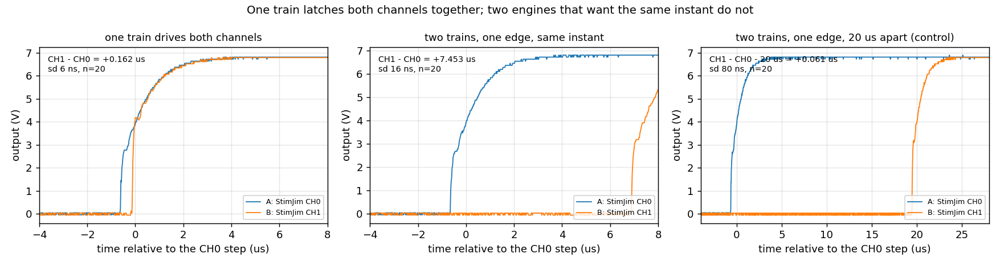
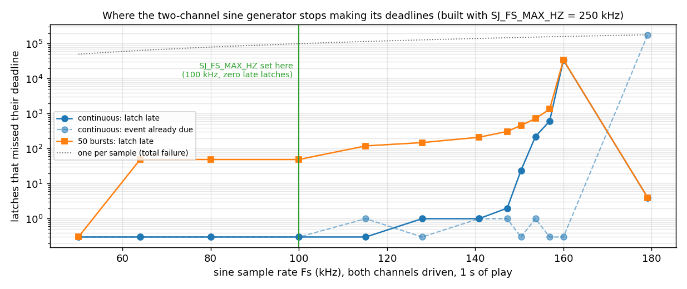
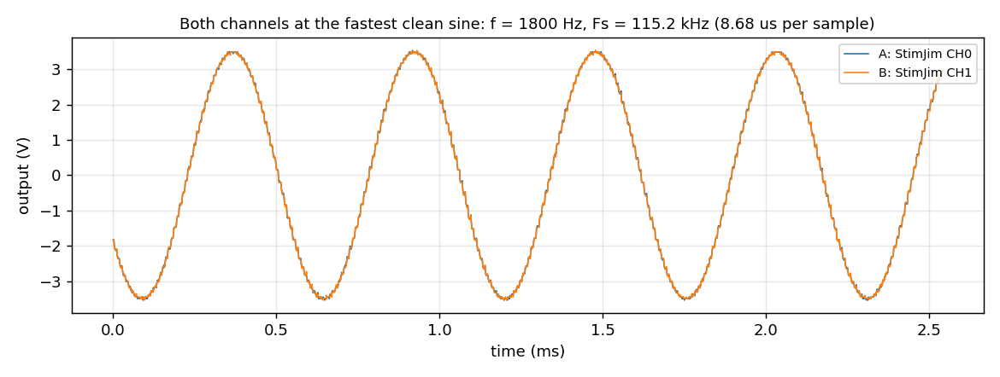
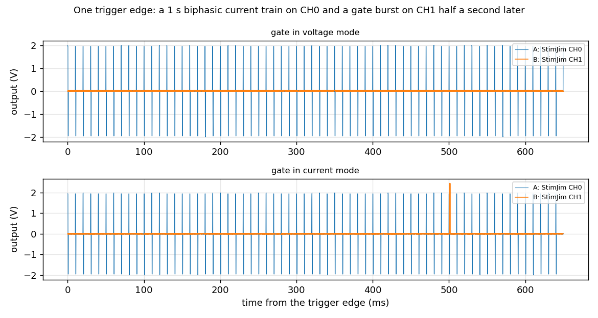
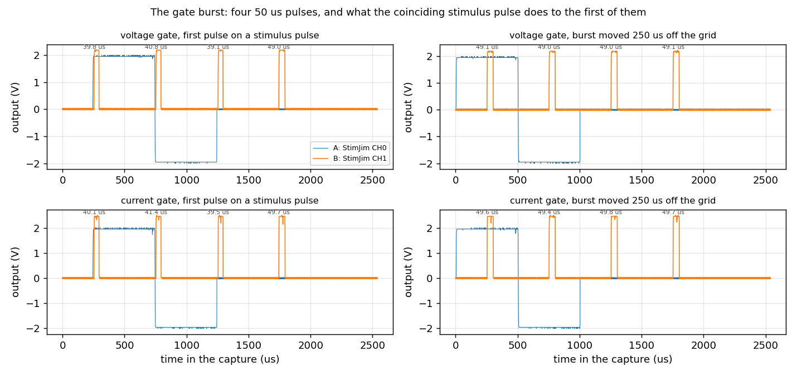

# Bench wiring for the stimjimAWG measurements that are still open

This document describes, from scratch, how to wire a StimJim board and an oscilloscope for each
measurement the `stimjimAWG` firmware still needs, and what to do once it is wired. It assumes
nothing beyond a StimJim running `stimjimAWG`, a two-channel oscilloscope with a signal generator
(a PicoScope 2204A is what the existing scripts drive), a handful of resistors and two LEDs. Every
number quoted as "measured" comes from a Teensy 3.5 at 120 MHz running the register backends.

Four of the firmware's timing budgets used to need an oscilloscope. Three no longer do:
`BENCHDAC`/`BENCHADC`/`BENCHPIT` measure the DAC, ADC and timer costs, `BENCHARM` measures the
cost of arming a train, and `BENCHSETTLE` measures how long after a latch a reading means
anything. What is left needs a scope because it involves an instant the firmware cannot observe —
the physical edge on a trigger pin — or a comparison between two outputs.

**Status.** All three configurations are measured (2026-09-08). The numbers are in each section
below, and `tests/device/trigcomp.py` (B) and `tests/device/dualchan.py` (C) repeat them.

Three wiring configurations cover everything below. Configuration A is the bench as it stands and
is the one `tests/device/capture.py` already drives; B and C are changes to it.

---

## Safety and setup, common to all three

- The two channels are isolated from each other and from the USB supply. An oscilloscope is not:
  its channel grounds are common. **Tie the scope ground to exactly one node of the load**, and
  never to two nodes that the StimJim drives independently, or the isolation is defeated through
  the scope.
- Keep the outputs grounded (`M0,3` and `M1,3`, which is the boot state) whenever you are
  changing wiring.
- The 2204A is 8-bit: on the ±10 V range one code is 78 mV. Keep every scope trigger level at
  least 1 V clear of the baseline, or the threshold sits inside the trigger hysteresis and never
  fires.
- Close the PicoScope application before running any script. It holds the USB device exclusively.
- With both scope channels enabled the capture buffer is 3968 samples and the fastest sample
  interval is **20 ns** (timebase 1; 40 ns and slower are also available, and every index the
  driver accepts delivers what it reports — `tests/device/scope_timebase.py` checks that against
  the unit's own AWG). Until 2026-09-08 `pico2000.py` mis-scaled the driver's interval and could
  never select anything faster than 640 ns, which is the floor earlier revisions of this document
  quoted. The buffer is the real constraint: 3968 samples at 20 ns is a 79 µs window, so fine
  resolution and a long window are alternatives.

---

## Configuration A — the load chain (what is on the bench now)

```
PicoScope AWG  ------------------------------> StimJim trigger input IN0

load chain, four nodes in series:

    CH1(+) ---- 1k ---- CH0(+) ---- 1k ---- CH0(-) ---[antiparallel LEDs]--- CH1(-)
      |                    |                   |
   scope B              scope A            scope gnd
```

The two antiparallel LEDs are deliberately different colours — one red, one blue. Their forward
voltages differ by about a volt, so the branch clamps at a different level in each polarity: the
load a positive half of a bipolar pulse sees is not the load the negative half sees. An `S` train
with a positive and a negative stage must read back two *different* clamp levels; a pair of equal
magnitudes would mean the firmware is reporting one stage's value for both.

The chain couples the channels, and the captures show it in both directions. Neither of these is
a fault:

- A CH0 pulse appears on **scope channel B**, because a channel no train drives is *grounded*,
  which ties CH1(+) to CH1(−) and hence to the LED branch. Below the LEDs' turn-on that branch
  carries no current, so scope B simply sits at CH0(+)'s potential; above it the LEDs clamp and
  scope B saturates at +2.2 V one way and −2.9 V the other.
- A CH1 pulse divides down onto **scope channel A**: with CH0 grounded, an 8 V pulse on CH1 reads
  about 0.5 V there.

### What A measures

| Test | Script | Result on this bench |
|---|---|---|
| `S`, `L` and `W` shapes on a real load | `python capture.py shapes` | `figs/stimjim-shape-*.png` |
| Post-trigger delay accuracy | `python capture.py delay` | 2000 µs set → 1999.3 measured; 5000 → 4999.3; 20000 → 19996.0 |
| Engine-to-engine offset | same run | −0.25 µs |
| Same-instant latch contention | same run | −10.1 µs (superseded: configuration C measures it directly at **7.39 µs**) |

The delay is measured differentially, because the AWG wire is not teed to a scope input: one
trigger edge starts a reference pulse on CH1 and the pulse under test on CH0, the scope triggers
on the reference, and the constant engine-to-engine offset is subtracted. That offset is
calibrated at a **500 µs** delay, not at 0 — at 0 the two first latches fall on the same instant
and the second player ISR waits for the first to return, which is the contention figure above and
is absent at every other delay.

---

## Configuration B — trigger edge and output on the scope at the same time

**Measures: the absolute delay from the physical edge at the input pin to the output actually
moving — the quantity `CAL TRIGCOMP` exists to cancel. On the Teensy 3.5 in hand the hardware part
is 2.27 µs and the shot-to-shot spread 41–49 ns. `CAL TRIGCOMP` is now set to 2 and
`CAL STARTLAT` to 20, which delivers 20.26 µs from the edge to the output.**

`tests/device/trigcomp.py` drives the whole of this section: `check` verifies the wiring
connection by connection, `threshold` measures the input pin's own switching level, and `measure`
takes the latency. Read that script's docstring for what each step proves; the rest of this
section is what the numbers turned out to be.

Change from A: tee the AWG output so the scope sees the edge it generates.

```
PicoScope AWG ---+---> StimJim trigger input IN0
                 |
                 +---> scope channel B          (the edge itself)

    CH0(+) ---- 1k ---- CH0(-)
      |                    |
   scope A             scope gnd

CH1 unused; leave it grounded (M1,3).
```

The 1 kΩ across CH0 is a plain resistive load: no LEDs, so there is no clamp to distort the edge
under test. Drop the load chain entirely for this measurement — the coupling that makes
configuration A informative only adds uncertainty here.

### Procedure

```
python trigcomp.py check                       # is the bench wired as above?
python trigcomp.py threshold                   # what level does IN0 switch at?
python trigcomp.py measure --threshold 1.757   # the latency itself
python ../../docs/figures/make_bench_figures.py
```

`check` proves six things separately, so a failure names the wire rather than corrupting a
number: the AWG reaches scope B, the AWG reaches IN0, scope A is on CH0(+), scope ground is at
CH0(−) rather than partway down a chain, CH1 and the LED branch are gone, and the load is a plain
resistor. The last of those is measured through **both** output modes, because one mode on its own
cannot tell a bad contact from a miscalibrated readback — see the load fault below.

`measure` reads whatever `CAL STARTLAT` and `CAL TRIGCOMP` the board is running (it never sets
them), defines `S20,90,3,100000,1000;8000,0,2000`, routes `TRIG0,1,20,-1,0`, and captures 30 shots
at 5 Hz per amplitude. Mode 90 rather than 0 turns in-train measurement off, which keeps the USB
serial quiet during the captures without touching the path being timed. Both budgets are written
into every row of `tmp/stimjim-trigcomp.csv`, so the figures describe the run that produced them.
To measure the raw hardware delay rather than the residual, set `CAL,TRIGCOMP,0` first.

### Two things the original procedure got wrong

**Reference the edge to the pin's threshold, not to half the AWG's amplitude.** The 2204A's square
wave takes 2.08 µs to slew its middle 1.58 V — 0.75 V/µs. Starting the clock at 1.00 V instead of
the level the pin actually switches at moves the answer by 1.35 µs, which is *half the quantity
being measured*. `trigcomp.py threshold` measures the pin instead of assuming it: it walks the
AWG's peak down until trains stop firing. On this board the transition is sharp — 1.780 V fires
every edge, 1.735 V fires none — so the threshold is **1.757 ± 0.022 V**, and the residual doubt
is worth only ±29 ns.

**Time the foot of the output step, not its 50 % point.** The 50 % crossing arrives after half the
output's settling, and that settling depends on the step size: it puts the answer 0.37 µs late on
an 8 V step and 1.13 µs late on a 2 V one. The first departure from baseline does not: 37.267 µs
at 8000 mV and 37.261 µs at 2000 mV, six nanoseconds apart across a 4× change of slew rate. That
agreement is the check that the load and the settling are not inside the number.

### What the number turned out to be

| | |
|---|---|
| edge (at 1.757 V) → output leaves baseline | **37.27 µs**, sd 49 ns over 30 shots |
| `CAL STARTLAT` in force for that measurement | 35 µs, `TRIGCOMP` 0 |
| hardware delay the budget does not cover | **2.27 µs** |
| output settling, foot to 90 % | 1.91 µs at 8 V, 2.93 µs at 2 V |
| after setting `STARTLAT` 20 and `TRIGCOMP` 2 | **20.26 µs** delivered, sd 41 ns |


**It is not a few hundred nanoseconds, and it is not only the pin-to-ISR delay.** Three delays sit
between the edge and the output, and this wiring sees only their sum:

- the pin edge reaching the trigger ISR's first instruction — the part `TRIGCOMP` is named for,
  and the only part that is a property of the MCU rather than the board;
- the PIT wake and its 96-cycle (0.8 µs) scheduling quantum;
- the `NLDAC` pulse and the AD5752's output beginning to move.

Separating them needs a probe on `NLDAC`, which is not brought out to a connector. So `TRIGCOMP`
is best read as *everything between the edge and the output that `STARTLAT` does not already
cover*, and setting it brings the delivered edge-to-output latency down to the budget.

**It is now set to 2, and that was a decision.** `TRIGCOMP` is subtracted only on the trigger path
(`t0 = edge − TRIGCOMP + STARTLAT + delay`), while two of its three terms — the PIT wake and the
DAC's latch-to-output delay — apply to a `T`/`U` start as well, so a triggered train's output now
leads a `T`-started one by about 2 µs. That trade buys an absolute, repeatable edge-to-output
latency, which is what a trigger input is for. `CAL` takes whole microseconds, so 0.26 µs of the
2.27 is left over.

Re-measured with `CAL STARTLAT` = 20 and `CAL TRIGCOMP` = 2 in force, the delivered latency is
**20.263 µs** at 8000 mV and **20.278 µs** at 2000 mV — `t0` at 18 µs plus the same 2.26 µs of
hardware, which is the check that the hardware term does not depend on the budget it is measured
against.

This is the only configuration that measures the instrument's **absolute** trigger-to-output
latency. Everything else on this bench is differential — the same edge starts a reference pulse on
the other engine — so the delays above cancel there and are invisible.

### What this configuration found about measuring current

The 1 kΩ across CH0 read as **3988 Ω** through the board's own voltage-mode measurement — stably,
linearly and symmetrically, at every amplitude. Neither the load nor the contacts: driving the same
resistor in **current** mode, where the pump forces a known current and the scope reads the
voltage, gives **991 Ω ± 2 %**, and the board's voltage readback agrees with the scope throughout.

The cause is in the analog path, not in the ADC. The DG409 output mux has a second bank that ties
`I_OUT` — the branch holding the 100 Ω sense shunt — to `CHANNEL_OUT` in current mode and to an
on-board 1 kΩ dummy in every other mode. So in voltage mode the sense amplifier was reading the
Howland pump's own current into that dummy, which tracks the DAC code and says nothing about the
load. **There is no shunt in the voltage path at all: on this hardware the load current in voltage
mode is not measurable.** The firmware no longer reports one, and says why once per train.


Check 6 therefore measures the load in current mode with the scope as the voltage reference, and
fails if a current appears in voltage mode. See [hardware-notes.md](hardware-notes.md) for the
topology and [serial-protocol.md](serial-protocol.md) §`MEAS` for what the rule does to `what`.

---

## Configuration C — the two channels compared against each other

**Measures: whether the two channels of one train latch together, how far apart two independently
routed trains land when they want the same instant, and the real `SJ_FS_MAX_HZ` ceiling for sine
playback. All three are measured; `tests/device/dualchan.py` repeats them.**

Change from A: both channels get their own resistive load and their own scope channel, with a
single common ground node.

```
    CH0(+) ---- 1k ---- CH0(-) ---+
      |                           |
   scope A                        +--- scope gnd
                                  |
    CH1(+) ---- 1k ---- CH1(-) ---+

PicoScope AWG ---> StimJim trigger input IN0   (only needed for the trigger tests)
scope B on CH1(+)
```

Tying CH0(−) and CH1(−) together defeats the channel-to-channel isolation, which is exactly what
makes this measurement possible and exactly why it is a separate configuration. **Do not use this
wiring with anything connected to a preparation.**

```
python dualchan.py check      # nine connections, each verified on its own
python dualchan.py c1         # the two-channel and two-engine latch comparisons
python dualchan.py c2         # the sine sample-rate ceiling
python dualchan.py usecase    # a stimulus on CH0 and a delayed gate on CH1
```

`check` proves the two loads are separate — driving one must not move the other, which is the
property that distinguishes this bench from A, where the series chain couples them — that scope
ground is at each channel's own return rather than partway down a chain, that each load is a plain
resistor measured in current mode with the scope as the voltage reference, and that the AWG
reaches IN0. On this bench the loads are **992 Ω** across CH0 and **1010 Ω** across CH1.

### C1 — do both channels of one train step together?

A train that drives both channels programs them with a single `dacProgramBoth` and latches them
with a single `NLDAC` pulse, so they should step together rather than a DAC programming time
apart. This is the claim that makes "one train driving both channels" the right construct for
sample-aligned stimulation.

Four cases, all captured at **20 ns/sample** with the trigger half way into the record, 20 shots
each, reported as CH1 minus CH0 at the same fraction of each channel's step:

| Case | at 50 % of the step | at the foot |
|---|---|---|
| one train drives both channels (`S30,90,90,20000,3000000;8000,8000,2000;0,0,2000`, `T30`) | **+0.162 µs**, sd 6 ns | +0.492 µs |
| two single-channel trains, one edge, independent route, both wanting the same instant | **+7.453 µs**, sd 16 ns | +7.543 µs |
| the same route, caught tens of pulses into a 3 s train | +7.454 µs | +7.541 µs |
| **control:** the same route with CH1 delayed 20 µs, so the latches never coincide | **+0.061 µs**, sd 80 ns | +0.150 µs |



**The control is what makes the rest mean anything.** Without it, a constant lead of one engine
over the other and the scope's own inter-channel sampling skew are both indistinguishable from
contention. Move the two engines 20 µs apart and the residual is 61 ns, so there is no constant
engine-to-engine offset and the measurement floor is under 100 ns. Subtracting it:

> **contention = 7.392 µs at the 50 % crossing and 7.393 µs at the foot.**

Those are two independent estimates — different points on the edge, different sensitivity to
settling — and they agree to a nanosecond, which is what says the 7.39 µs is a delay and not a
difference in how the two channels settle. It replaces the "9–10 µs at the output" that
configuration A measured differentially through the LED chain, and it sits close to the 7.3 µs the
engine's own overdue counter has always reported.

**The first latch after the arm is not special.** The two arms run one after the other inside the
trigger ISR, so the first latch might have been expected to cost more than a later one. It does
not: 7.453 against 7.454 µs. The arms finish before `t0`; what collides is the two player ISRs,
and that happens identically at every coincident latch for the life of the train.

**One train's two channels pass.** 0.162 µs is well under the 2 µs that programming a second
channel separately would cost (`CAL DACPROG2` − `DACPROG1`), so the two channels are latched
together. They are not simultaneous to the nanosecond, and nothing on this hardware makes them so:
the 50 % crossing and the foot disagree by 0.33 µs, which is a difference in settling between two
output stages driving two different resistors, not a difference in latch instant. Read the number
as *one latch, two analog paths*.

### C2 — the sine sample-rate ceiling

`SJ_FS_MAX_HZ` was 50 kHz on the register backend and was a desk estimate. The measured sustained
ceiling is three times that.

The sweep plays a two-channel sine for 1 s at each rate, twice: once as **one continuous burst**,
which measures the sustained sample rate, and once as **50 bursts of 20 ms**, which adds a burst
boundary 50 times. Walking past 50 kHz needs a build with the cap raised
(`--build-property "build.flags.defs=-D__MK64FX512__ -DTEENSYDUINO=160 -DSJ_FS_MAX_HZ=250000"`;
the constant is `#ifndef`-guarded so `-D` reaches it).

| Fs | µs/sample | continuous: late latches in 1 s | in 50 bursts |
|---|---|---|---|
| 50.0 kHz | 20.00 | 0 of 50 000 | 0 |
| 64.0 kHz | 15.63 | 0 of 64 000 | 49 (≈1 per burst) |
| **100.0 kHz** | **10.00** | **0 of 100 000** | 49 |
| 115.2 kHz | 8.68 | 0 of 115 163 | 116 |
| 128.0 kHz | 7.82 | 1 of 127 931 | 149 |
| 147.2 kHz | 6.79 | 3 of 147 239 | 323 |
| 150.4 kHz | 6.65 | 22 of 150 375 | 444 |
| 153.6 kHz | 6.51 | 220 of 153 649 | 645 |
| 156.9 kHz | 6.38 | 597 of 156 862 | 1 268 |
| 160.0 kHz | 6.25 | **33 903** of 160 000 | 34 289 |
| 179.1 kHz | 5.58 | 4 late, but **179 101 of 179 104 already due** | the same |



Read the two counters together. `WARN engine: … overran their deadline` counts events whose DAC
programming finished after a deadline that was **still in the future**, so it only counts while the
player is keeping up at all; `# engine: … already due` counts events the player reached after their
instant had passed. Past about 175 kHz the first falls back to nearly nothing and the second goes
to one per sample — the generator has collapsed, and a plot of overruns alone would read as
recovery.

There are three regimes: nothing late at all up to **115 kHz**; one late latch per *train*, not per
sample, from 128 to 147 kHz; and lateness proportional to the sample count from **150 kHz**, with a
knee at 160 kHz. `SJ_FS_MAX_HZ` is now **100 000** — the fastest rate measured with zero late
latches, a third below where lateness starts to scale. `f_max` above `Fs/2 = 50 kHz` is still
refused at start, and since `Fs = 64·f_max` the clamp is now reached at f = 1562.5 Hz.



**A bursted sine costs about one late latch per burst, and that is separate from the rate.** With
`burst_us == period_us` the off event at the burst boundary lands off the sample grid — `Fs` is
realized as a whole number of CPU cycles, so 50 kHz divides 120 MHz exactly and 57.6 kHz does not —
and one or two latches per boundary finish a few µs late. It appears from 64 kHz upward, grows to
about four per burst at 141 kHz, and never exceeds a few µs. It does not scale with the sample
count and it lands on the park at the end of a burst, so it does not distort the sine body. It is
why the ceiling above is quoted from continuous playback.

### C3 — a worked example: stimulate on CH0, gate on CH1

The construct most experiments want is two rhythms from one trigger: a stimulus train on one
channel and a shorter gating burst on the other, offset in time. Two rhythms means two trains, two
trains means two engines, and one edge means an independent route — the one arrangement on this
instrument that cannot sample-align its channels. This is what that costs.

```
S34,1,3,10000,1000000;2000,0,500;-2000,0,500   # CH0: 2 mA biphasic, 500+500 us, every 10 ms for 1 s
S35,3,0,500,2000,500000;0,2500,50              # CH1: 2.5 V gate, 50 us every 500 us x 4, 0.5 s later
TRIG0,2,34,35,0                                # one edge starts both
CAL,STARTLAT,35                                # an independent route arms two engines and needs 30-35
```



The gate delay of 500 000 µs is an exact multiple of the stimulus period, so the gate's rising
edges at +0, +500 and +1000 µs land on stimulus events — the two phase starts and the park — while
its falling edges at +50, +550 and +1050 µs land on nothing. The rises are pushed back by the
contention and the falls are not, so **the first three gate pulses come out about 10 µs short**:

| gate mode | pulse widths on the stimulus grid | 250 µs off the grid |
|---|---|---|
| voltage | 39.9, 40.8, 39.1, **49.0** µs | 49.1, 49.0, 49.0, 49.1 µs |
| current | 40.1, 41.4, 39.5, **49.7** µs | 49.6, 49.4, 49.8, 49.7 µs |



The fourth pulse is full width in both cases: its rise at +1500 µs has no stimulus event on it. The
firmware says the same thing without a scope — `# engine: 3 event(s) were already due …, worst by
7425 ns` on the aligned run, and no timing fault at all on the staggered one.

**The fix is to move the gate off the stimulus grid.** A delay of 500 250 µs instead of 500 000
puts every gate event a quarter period away from every stimulus event, and all four pulses come out
49 µs wide with 500.0 µs between rises. Nothing else changes. The alternative — one train driving
both channels — is not available here: a slot has one period and one stage list, and these two
signals share neither.

**Voltage and current mode differ in what reaches the load, not in timing.** The two rows above
agree to within the measurement. What differs is amplitude: 2500 mV commanded gives **2.207 V**
across the 1010 Ω load, while 2500 µA gives **2.479 V** — the ~135 Ω of source impedance measured
in phase 018, worth a 12 % droop in voltage mode and nothing at all in current mode. The board's
own readback agrees with the scope in both, and in voltage mode it reports no current, which is
correct on this hardware ([hardware-notes.md](hardware-notes.md)).

The stimulus itself is unaffected throughout: 2000 µA into 992 Ω reads +1.96 / −1.96 V with a
charge imbalance under 0.2 %, and `MSUM` reports 1981 µA and −1984 µA over 100 pulses with a
0.5 µA standard deviation.

---

## Tests that need no wiring change at all

These are the ones worth running first, because they are cheap and two of them replace scope work
that used to be required.

| Question | Command | Expected on a Teensy 3.5 |
|---|---|---|
| `CAL SETTLE` | `M0,0` then `BENCHSETTLE,0,8000,20,64` | readings stop moving at 8–9 µs |
| `CAL STARTLAT` | `python bench_arm.py COM4` | 9.0 µs undriven, 11–12 µs for a one-stage `S`/`L`/`W` measured or not, 15.0 µs for a ten-stage `L` |
| DAC and ADC costs | `BENCHDAC`, `BENCHDAC2`, `BENCHADC`, `BENCHSW` | 2.81 / 4.14 / 3.81 / 6.06 µs worst |
| Timer wake and latch jitter | `BENCHPIT,1000,2000` and `BENCHPIT,1000,2000,4` | 0.47 µs worst wake, 42 ns residual jitter |
| Does anything miss a deadline? | run a train, read the completion | silence |
| Full serial regression | `python smoke.py COM4` | `ALL CHECKS PASSED` |

**Long-run drift** also needs no wiring: `python longrun.py COM4 --seconds 300` starts a train with
a long `duration_us` and a long period, waits, and reads the completion. The 64-bit cycle counter
is extended by the player's own wake-ups, so the failure mode this looks for is a missed
extension, which shows up as a completion that never arrives, a pulse count that does not match
`duration/period`, or a completion 35.79 s — one 32-bit wrap at 120 MHz — from where it belongs.

Measured 2026-09-08: a 300 s train at one pulse a second crosses the wrap 8.4 times and delivered
**300 of 300 pulses**, its completion 0.4 s from the requested duration by the host clock (which
is itself only good to a few hundred ms over USB), with no timing fault reported. `--seconds 3600`
runs the hours-long version; the wrap is crossed either way, and an extension that does not work
fails on the first crossing.
