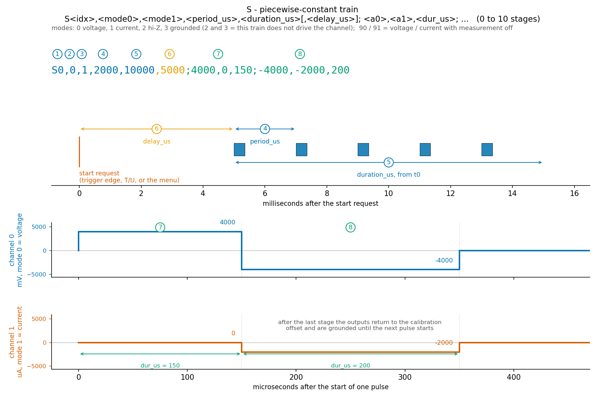
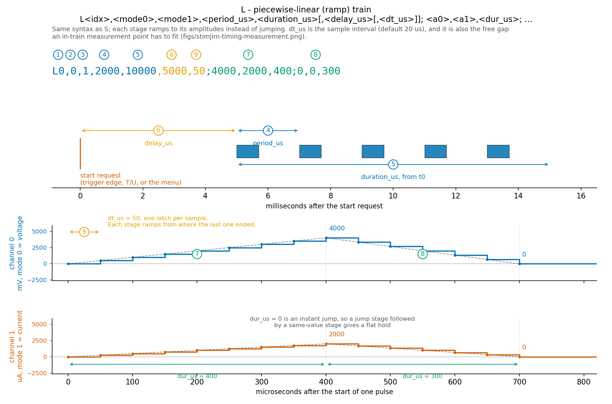
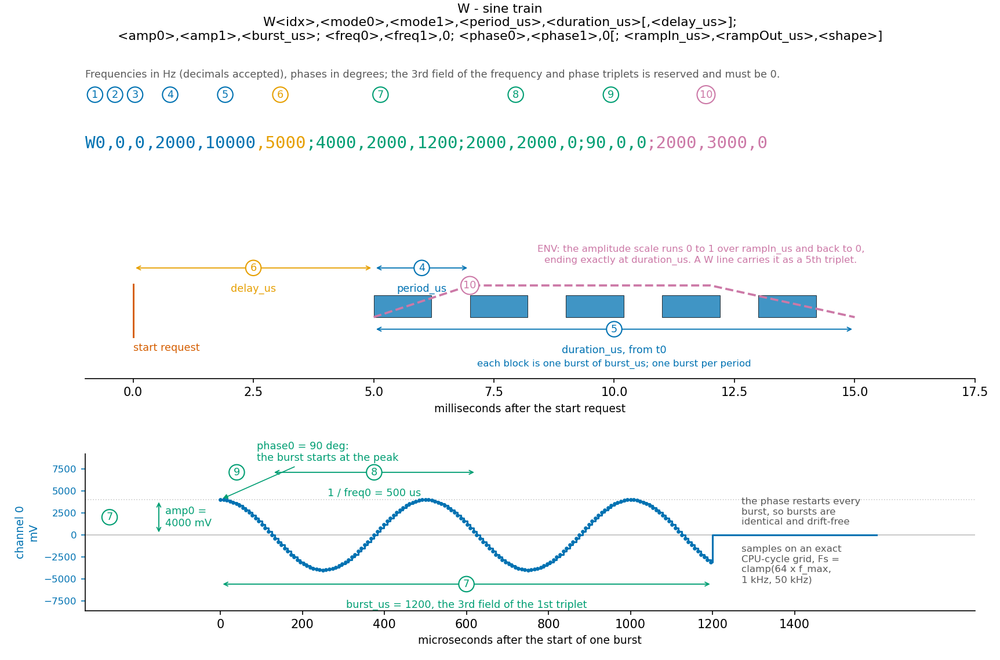
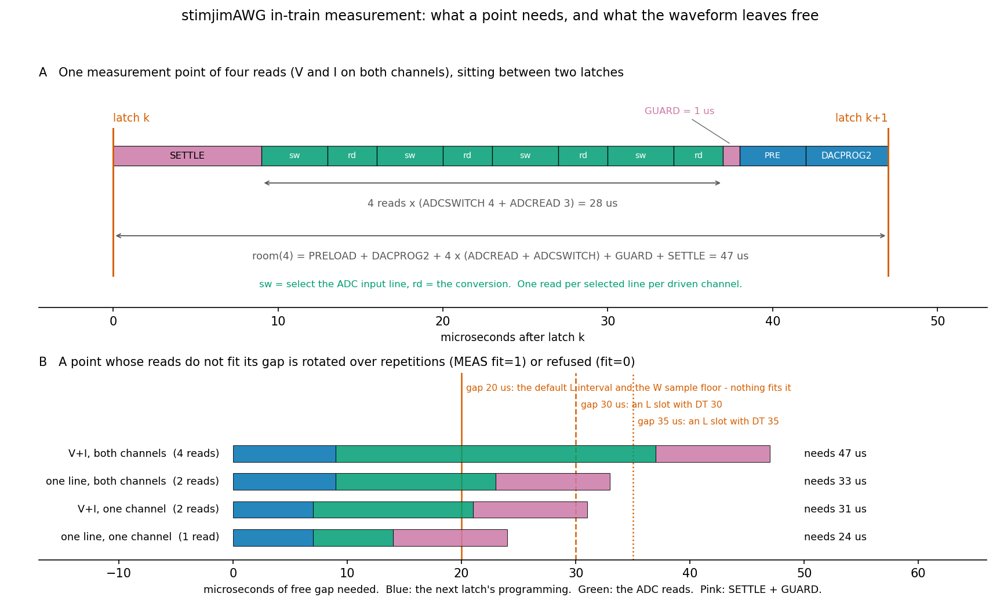
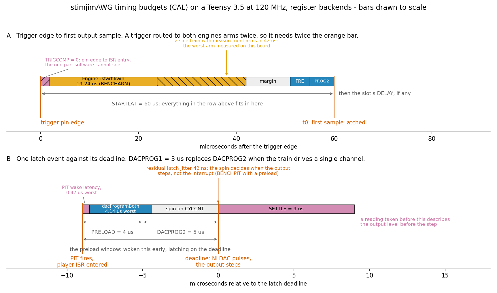

# stimjimAWG serial protocol reference (draft)

Status: protocol version 1. Implemented: waveform definition and queries (`S`/`L`/`W`,
`DELAY`, `DT`, `ENV`/`MEAS`), `T`/`U` playback of all three slot types with the `ENV` envelope,
`TRIG`/`R` trigger routing, the immediate commands (`M`/`V`/`A`/`E`/`READ`, `B`/`C`/`D`),
persistence (`P`), in-train measurement (`MEAS` execution with its `MSUM` summaries and
`MDATA` stream), SD logging (`LOG`) with serial access to the card (the `SD` group), and
`STAT`/`IDN`/`HELP`/`SCREEN`/`DUMP`/`BENCH`, and the runtime timing budget (`CAL`).
**Not implemented:** the button menu editor.
See [awg-implementation-plan.md](awg-implementation-plan.md) for what remains,
[timing.md](timing.md) for latency and CPU-occupancy figures gathered in one place, and
[bench-wiring.md](bench-wiring.md) for the measurements that still need an oscilloscope. The legacy
sections below double as documentation of the sibling `stimjimPulser` firmware in this
repository; the "hardened" notes describe where stimjimAWG deliberately differs from it.

Backward-compatibility contract: every command of `stimjimPulser` keeps its syntax and semantics;
`M`/`V`/`A`/`E` keep **byte-compatible single-line replies** because StimJimBIST performs exactly
one `ReadLine()` per command and parses `E`'s `(<value><unit>)` group.

## 1. Conventions

- **Framing**: lines terminated by `\n` (`\r` stripped); max 999 bytes + NUL (1000-byte buffer,
  bounded — overflow discards to next `\n` and replies `ERR line too long (max 999)`). Blank lines
  and lines starting with `#` are ignored, so `DUMP` output can be replayed verbatim.
- **Dispatch**: leading alphabetic run = command word. One letter → legacy command; two or more
  letters → long-form command. Collision-free: legacy letters are always followed by a digit, `-`,
  `,`, `?` or end of line. The single-letter namespace stays reserved for waveform-definition and
  terse commands (`L` is the one new single-letter command, sibling of `S`/`W`).
- **Query suffix `?`**: for every settable object, `<word><idx>?` returns exactly one line — the
  canonical set-command that reproduces the current state (round-trippable). `S<idx>?` on a slot
  answers with the letter matching its actual type (`S`, `L` or `W` line).
- **Replies**: new setters echo the canonical round-trip line of what was stored. Errors:
  `ERR <cmd>: <message>` — the command is rejected and prior state is fully intact (atomic
  staging-buffer commit; edits to a currently-running slot are refused). Warnings:
  `WARN <cmd>: <message>` — accepted with caveat. Multi-line human output (`HELP`, `DUMP`, legacy
  parameter dumps) ends with a lone `OK` line.
- **No silent defaults in new code paths**: omitted required fields produce a one-line `ERR`
  instead of assuming 0 (fail-loudly; see compatibility appendix §6).
- Machine parse rule: classify a reply line by its first token — `ERR`, `WARN`, `OK`, `#`, a
  command word (round-trip data), else legacy human text.

## 2. Waveform definition commands

Each train type has a figure showing which field sets which part of the waveform; the numbers
in the drawing are the numbers in the command line. They are generated by
`docs/figures/make_param_figures.py`.

| | |
|---|---|
|  | |
|  | |
|  | |

Common header for `S`/`L`/`W`:
`<idx>` 0–99 (slot), `<mode0>,<mode1>` per physical channel (below), `<period_us>` interval
between pulse/burst starts, `<duration_us>` total train length, and the optional
`<delay_us>` below — plus, on an `L` line only, the optional `<dt_us>` after it.

**Optional 6th header field — `delay_us`.** A legacy header ends after `duration_us` (the next
character is `;` or end of line), so a `,` in that position can only be the new field: the
extension is unambiguous and every pre-existing command line keeps its exact meaning. The delay
is the wait between the *start request* and the train's first sample. It applies to every start
path — a trigger edge, `T`/`U`, or the menu — so a delay can be verified over the serial port
before it is wired to a trigger. The whole train timebase (pulse grid, envelope, duration)
begins after the delay, so the delay shifts the waveform without changing its length; the
outputs stay grounded throughout it. Range 0…2 000 000 000 µs (2000 s); out of range → `ERR`.

Omitting the field **resets the delay to 0**, the same rule the `W` envelope triplet follows: an
`S`/`L`/`W` line fully defines its own header, so replaying an old script reproduces the old
behaviour exactly and can never inherit a delay set earlier. Set `DELAY` *after* defining the
waveform, or carry the delay in the line itself. Queries emit the field only when it is
non-zero, so a delay-free slot still serializes to a line older firmware would accept; round-trip
stays exact because an absent field parses back as 0.

```
S0,0,1,2000,1000000;100,0,150        # legacy line: no delay
S0,0,1,2000,1000000,5000;100,0,150   # same train, 5 ms after the trigger
```

**Mode field** — the original stimjim numbering (same as `M`): 0 voltage, 1 current,
2 disconnected (hi-Z), 3 grounded. In a train definition 2 and 3 both mean *this channel is not
driven by this train* (its output pins are left untouched, exactly like the original open-ephys
firmware; the channel is never measured). Two additional values are accepted **in train
definitions only**: `90` = voltage and `91` = current **with measurement disabled** on that
channel. They are parse-time sugar: the slot stores mode 0/1 and the `MEAS` `what` for that
channel is forced to 0; conversely a plain 0/1 re-enables measurement (a stored `what` of 1/2 —
a deliberate `MEAS` refinement — is preserved, a stored 0 is promoted back to the default 3).
Queries render 90/91 whenever the stored `what` is 0, so the flag round-trips through
`S<idx>?`/`DUMP`. Any other mode value → `ERR`.

> Lab-firmware migration note: the previous lab firmware re-documented 2/3 as
> voltage/current-without-measurement and 4/5 as hi-Z/ground. That numbering is retired
> (see §6.8): scripts using modes 2/3 for unmeasured stimulation must switch to 90/91 —
> under this firmware 2/3 mean an *inactive* channel again.

### `S` — piecewise-constant (rectangular step) train — legacy semantics, bit-exact

```
S<idx>,<mode0>,<mode1>,<period_us>,<duration_us>[,<delay_us>]; <a0>,<a1>,<dur_us>; ...  (0–10 stages)
S<idx>          → query (safe, never writes)      S<idx>?  → canonical one-line form
```

A stage count of 0 stays accepted (legacy "empty train" — the boot default; the train runs its
period/duration bookkeeping but emits nothing).

Amplitudes in mV (voltage modes) or µA (current modes). Each stage *jumps* to its amplitudes and
holds for `dur_us`. After the last stage the DAC returns to offset (0) and outputs are grounded.

Hardened vs stimjimPulser: parse into staging buffer, validate, commit — a malformed line leaves
the slot untouched (old firmware half-updates, see fixme at `stimjimPulser.ino:925`); modes
outside {0–3, 90, 91} → `ERR` (old: silently coerced out-of-range values).

### `L` — piecewise-linear (ramp) train — NEW

```
L<idx>,<mode0>,<mode1>,<period_us>,<duration_us>[,<delay_us>[,<dt_us>]]; <a0>,<a1>,<dur_us>; ...
```

Identical syntax to `S`; each stage **ramps linearly from the previous end value** to
`(a0,a1)` over `dur_us`. `dur_us = 0` = instant jump, so piecewise-constant is expressible as
jump+hold pairs:

```
L0,...;1000,-1000,200      # ramp 0 → (1000,−1000) over 200 µs
L0,...;1000,0,0;1000,0,500 # jump to 1000, hold 500 µs (ramp from 1000 to 1000)
```

A 0-duration stage is legal anywhere, including first and last, and means "shift the level here,
then ramp on from it". **Two of them in a row are refused**: they would ask for two levels at the
same instant, so the first could never be delivered — one sample latches, carrying the second
value. The `ERR` names the pair rather than silently dropping a level. `S` is unaffected: there a
0-duration stage is a rectangular step of zero length, legal in any number, and `S` keeps its
bit-exact legacy semantics.

**Optional 7th header field — `dt_us`, the ramp sample interval.** It defaults to 20 µs (the
build's `SJ_TARGET_DT_US`) and is settable per slot, either as this field or with `DT` below.
The field is positional, so a slot that wants an interval and no delay writes the delay as `0`;
it is accepted on `L` lines only — on `S` and `W` a 7th field is an `ERR`, not a silently ignored
number. Omitting it resets the interval to the build default, the same rule the delay follows.
Range 2…1 000 000 µs at parse time; an interval below what one latch costs on this board
(`CAL PRELOAD + DACPROG1/2 + 3 µs`) is **refused at start** with the arithmetic, because that
budget is runtime state.

A coarser interval is the honest way to make room for an in-train measurement point: the free gap
a point lives in *is* the sample interval (§4), and stretching the interval changes how finely
the ramp is approximated rather than what the waveform is worth measuring. The other way out is
`MEAS` `fit`, which keeps the interval and thins the sample count instead.

```
L0,0,1,2000,1000000,0,50;4095,0,1000    # 1 ms ramp sampled every 50 µs (20 samples)
```

Last sample lands exactly on the stage boundary and end value (integer Bresenham, plan §3.5 — no
rounding accumulates across samples or stages). Each pulse ramps from the parked offset (0) and, after the last stage
boundary, parks and grounds like `S`: the final stage's end value is latched exactly at the
boundary and immediately parked — append a same-value stage to hold it.

### `W` — sine train — explicit fields, phase fixed

```
W<idx>,<mode0>,<mode1>,<period_us>,<duration_us>[,<delay_us>];
   <amp0>,<amp1>,<burst_us>;      # amplitudes (mV/µA), burst length per period
   <freq0>,<freq1>,0;             # frequency in Hz, decimals accepted (stored as mHz); 3rd field reserved, must be present
   <phase0>,<phase1>,0[;          # start phase in degrees — NOW APPLIED (old firmware ignored it)
   <rampIn_us>,<rampOut_us>,<shape>]   # optional 5th triplet = envelope (see ENV)
```

Omitting the 5th triplet resets the envelope to `0,0,0` — a full `W` line fully defines the slot,
keeping query output round-trip exact. Legacy `W` lines (4 triplets, integer Hz) parse unchanged.

Playback (plan §3.5): each period runs one burst of `burst_us`; the **phase restarts at
`phase` every burst** (bursts are identical and drift-free; legacy-consistent), and the output
parks at offset + grounds between bursts. `burst_us = period_us` is continuous sine except for a
few-µs park at each period boundary (same as legacy; a gapless mode may suppress the off event
later). Sample rate per train: `Fs = clamp(64·f_max, 1 kHz, 50 kHz)` on an exact CPU-cycle grid
(the 50 kHz ceiling is a desk estimate, not a measured limit). Frequencies above `Fs/2 = 25 kHz`
are accepted at parse time but **refused at start** with a `WARN` (Nyquist).

Known hardware limit (see [hardware-notes.md](hardware-notes.md)): amplitudes above 3000 µA
convert incorrectly on the DAC → `WARN` on set.

## 3. Execution, trigger and immediate commands

| Cmd | Syntax | Reply / notes |
|---|---|---|
| `T` | `T<idx>` start slot on engine 0; `T-1` stop engine 0 | legacy reply lines kept: `\r\nStarted T train with parameters of PulseTrain <idx>` / `Forcing T train to stop` / `Invalid PulseTrain index.`. Busy engine or channel conflict with the other engine → drop + `WARN` (decision: ignore-and-warn). Strict index parse: `Tfoo` → `ERR` (legacy `atoi` silently started train 0). Train completion prints `Train #<n> complete. Delivered <p> pulses.` from `loop()`; `MSUM` lines will follow it once the measurement engine exists. |
| `U` | `U<idx>` / `U-1` | same, engine 1 (players are per-engine; a train drives the channels its modes activate) |
| `R` | `R<trig>,<idx>[,<output>]` | **legacy alias** writing the `TRIG` table: `output≠0` → marker mode (`TRIG<t>,3,-1,-1,0`); else joint start of `idx` on rising edge (`TRIG<t>,1,<idx>,-1,0`). `R<t>?` renders the legacy view. NOTE: the old README documented the 3rd arg as an edge selector — the code's actual meaning is the output-marker flag; edge selection lives in `TRIG`. |
| `M` | `M<ch>,<mode>` | exactly 1 line: `Set channel <ch> to mode <mode>`. Modes: 0 voltage, 1 current, 2 disconnected (hi-Z), 3 grounded — original numbering, mapping 1:1 onto the OE decoder (§6.8). 90/91 are train-definition sugar and are rejected here. `M<ch>?` returns shadow state (new); running trains switch the OE pins autonomously (driven channels end grounded, shadow tracks that). |
| `V` | `V<ch>,<mV>` immediate voltage | exactly 1 line: `Set channel <ch> to amplitude <mV> mV (dac value <dac>).` or `<dac> is out of range.` During a running train: executed under bus lock + `WARN`. |
| `A` | `A<ch>,<dac>` immediate raw DAC (−32768…32767) | exactly 1 line: `Set channel <ch> to amplitude <dac>` |
| `E` | `E<ch>,<line>` read ADC; line 0 = output voltage, 1 = current sense | exactly 1 line: `Read value: <raw> (<value>mV)` / `(<value>uA)` — format frozen for BIST |
| `B` | recalibrate ADC offsets (grounds outputs) | `OK` when done (legacy printed nothing, §6); refused while a train runs |
| `C` | recalibrate current+voltage offsets | prints `WARN C: output will ramp` first — `getVoltageOffsets()` sweeps a voltage ramp on the outputs |
| `D` | print offsets (human); `D?` machine CSV: `D,<adc25_0>,<adc25_1>,<adc10_0>,<adc10_1>,<ioff0>,<ioff1>,<voff0>,<voff1>` | |
| `P` | save slots 0–9 + ENV/MEAS + TRIG table + the `CAL` timing budget to EEPROM (versioned, checksummed) | legacy confirmation |

## 4. New long-form commands

### `DELAY` — per-train post-trigger delay

```
DELAY<idx>,<delay_us>        0 .. 2000000000 (2000 s)
DELAY<idx>?  →  DELAY<idx>,<delay_us>
```

Convenience setter for the same field the `S`/`L`/`W` header carries as its optional 6th
value (§2, which also documents the semantics and the reset-on-redefinition rule). Refused
while the slot is attached to a running train, like every other slot edit.

Accuracy: the delay is an exact integer cycle count on the `cycles64()` timebase. Measured on a
PicoScope 2204A from the trigger edge to the first output sample, corrected for the constant
engine-to-engine offset: 2000 µs set → 1999.3 µs, 5000 → 4999.3, 20000 → 19996.0, every residual
inside the scope's own sample interval (2.56 µs on the first two, 10.24 µs on the third). The
engine-to-engine offset itself is **−0.25 µs**, down from the −7.5 µs of the per-engine arm
anchor, because both engines armed by one edge share the edge's timestamp as their `t0`.

### `DT` — per-train ramp sample interval

```
DT<idx>,<dt_us>              0 = the build default (SJ_TARGET_DT_US, 20 µs), else 2 .. 1000000
DT<idx>?  →  DT<idx>,<dt_us>
```

Convenience setter for the same field an `L` header carries as its optional 7th value (§2, which
documents the semantics, the reset-on-redefinition rule and the start-time floor). Accepted on
`L` slots only — on an `S` or `W` slot it is an `ERR`, since neither has a sample interval —
and refused while the slot is attached to a running train, like every other slot edit.

### `ENV` — per-train amplitude envelope

```
ENV<idx>,<rampIn_us>,<rampOut_us>[,<shape>]      shape: 0 = linear (default; 1 = raised-cosine reserved)
ENV<idx>?  →  ENV<idx>,<in>,<out>,<shape>
```

Envelope 0→1 over `rampIn` from train start, 1→0 ending exactly at `duration_us`. Applies to all
waveform types, evaluated at each latch event (plan §3.5): `L`/`W` trains follow it per sample,
`S` trains sample it at each stage latch (stair-step over a long stage — use `L` for smooth
ramps). It scales amplitudes relative to the channel's calibration offset (the parked baseline
does not move). Validation: `rampIn + rampOut ≤ duration` else `ERR`. Default `0,0,0`.

### `MEAS` — per-train measurement configuration

```
MEAS<idx>,<what0>,<what1>,<when>,<stage>[,<report>[,<fit>]]
MEAS<idx>? →  MEAS<idx>,<what0>,<what1>,<when>,<stage>,<report>,<fit>
```

- `what<ch>`: 0 none, 1 voltage, 2 current, 3 both. Coupled to the train-definition mode field
  (§2): mode 90/91 forces 0; a plain 0/1 promotes a stored 0 back to 3 (an explicit 1/2 is
  preserved). Channels the train does not drive (mode 2/3) are never measured; setting a
  non-zero `what` on one is accepted with `WARN` (meaningless until the mode changes).
- `when` — the measurement instant inside the selected stage/period; codes are type-specific
  and a mismatch → `ERR` (changing a slot's type auto-coerces `when` and `stage` to the new
  type's defaults):
  - `S`/`L` slots: **0** = near stage end — transient settled, ADC programming time budgeted
    (plan §3.6). The only v1 code; a reserved `<offset_us>` extension field is documented for
    future manual placement.
  - `W` slots: **1** = positive peak, **2** = negative peak, **3** = both peaks. One period per
    burst is measured (the first full period after envelope ramp-in completes): at generation
    rates the V+I ADC budget (~9–11 µs) rules out per-sample measurement, and mid-ramp peaks
    would under-read.
- `stage`: −1 = every stage (default), 0…nStages−1 = only that stage (`S`/`L`; subsumes the
  earlier first-stage-only mode). `W` slots require −1. An `S`/`L` redefinition that shrinks
  the stage count below a stored selection → `ERR` (reset `MEAS` first) — same policy as a
  preserved `ENV` that no longer fits.
- `report` bitmask: 0 end-of-train summary (always kept), +1 stream `MDATA` lines, +2 log to SD.
- `fit`: what to do when a point's reads do not fit the free gap they live in. **0** = refuse the
  point (nothing measured, reported twice — the pre-Phase-8 behaviour), **1** = rotate the reads
  over consecutive repetitions (the default). Both are detailed below.
- An omitted optional field takes its default rather than the stored value: a `MEAS` line fully
  defines the slot's measurement configuration, the same rule `S`/`L`/`W` headers follow.
- Repetitions (one measurement point per pulse/burst) accumulate `n`, Σv and Σv² per point,
  line and channel; the summary reports the mean **and the sample standard deviation** derived
  from those sums. This is the single-pass estimator — numerically simplified by design
  (documented trade-off; adequate for 13-bit ADC data at the repetition counts a train can
  reach), chosen so a waveform averaged over many repetitions also yields a spread estimate.
- Defaults: `what0=what1=3`, `when=0` for `S`/`L` slots / `3` for `W` slots, `stage=-1`,
  `report=0`, `fit=1` — measure everything, summary only (reproduces legacy averaging behavior).



**How much time a measurement point needs.** Each ADC value costs a control-register write to
select the input line plus the conversion itself. The reads must end before the next latch event
starts *programming* the DAC, which happens `PRELOAD + DACPROG*` early, and they cannot start
until the previous latch has settled. So a point needs

```
room = (CAL PRELOAD + CAL DACPROG1/2)
     + nReads * (CAL ADCREAD + CAL ADCSWITCH)
     + CAL GUARD + CAL SETTLE
```

`nReads` counts the values actually taken — one per selected line per driven channel — and the
DAC programming term is `DACPROG1` when the train drives one channel, `DACPROG2` when it drives
two. Every term is a runtime `CAL` parameter (below), so the numbers in the tables that follow
describe the *default* budget of a Teensy 3.5 register build and change with the calibration.
That room must fit the free gap the point lives in:

| Slot type | The free gap is |
|---|---|
| `S` | the stage duration |
| `L` | the stage's *ramp sample interval* (stage duration / N, 20 µs by default) — not the stage |
| `W` | the sine sample interval `1/Fs`, which is never shorter than 20 µs because Fs is capped |

On a Teensy 3.5 with the default `CAL` budget that works out to:

| What is measured | `nReads` | room | Fits an `L` train at the default 20 µs? | Highest `W` frequency |
|---|---|---|---|---|
| one line, one channel | 1 | 24 µs | no | 651 Hz |
| V+I, one channel | 2 | 31 µs | no | 504 Hz |
| one line, both channels | 2 | 33 µs | no | 473 Hz |
| V+I, both channels | 4 | 47 µs | no | 332 Hz |

**No measurement point fits the default 20 µs ramp interval.** That is a consequence of
`SETTLE` being 9 µs — the measured figure, not the 4 µs desk estimate the firmware shipped with
until it was checked with `BENCHSETTLE`. A reading taken 4 µs after a latch is 8–9 % short of
the value the output eventually reaches, so the old budget bought coverage by measuring
transients. An `L` slot that wants in-train measurement needs `DT` at 26 µs or more; an `S`
slot is unaffected as long as its stages are that long, which most stimulus stages are.

**The waveform is never stretched to make room for the instrumentation.** What happens instead
depends on `fit`.

*`fit = 0`, strict.* The point is **refused**: a `WARN MEAS:` line at start names the required
and available times, the point never fires, and the summary still emits its `MSUM` line with
`n = 0` plus a `#` line repeating the reason.

*`fit = 1`, rotate (the default).* The reads are split into the smallest number of groups that
each fit one gap, and **one group fires per repetition**, cycling by pulse index. Every read
still happens at exactly the instant the point's label names — the stage end, or the peak sample
— so no reading describes a different part of the waveform than it claims. What shrinks is `n`:
each line accumulates about `nPulses / nGroups` samples. A `#` line at start states the group
count and how thin the per-line count gets; the per-point `#` line in the summary repeats it,
because `MSUM` has one `n` field per point and with rotation it carries the largest of the four
lines' counts (they differ by at most one). `MDATA` needs no change — its `valid` mask already
says which lines a row carries, so a rotated row is simply a partial one.

Rotation is not magic: when not even *one* read fits the gap, the point is refused whatever
`fit` says, and the reported requirement is then `room` for a single read — the number that
would have to change for the point to become measurable at all. Nor does it help a train with
fewer repetitions than groups; `planBuild` compares `duration_us / period_us` against the group
count and warns when some lines would never be read.

With rotation the same board reaches:

| Case | gap | reads per gap | outcome |
|---|---|---|---|
| `L`, V+I both channels, `dt` 20 µs | 20 µs | 0 (needs 26) | refused — raise `dt` |
| `L`, V+I both channels, `dt` 30 µs | 30 µs | 1 | 4 groups: every 4th pulse per line |
| `L`, V+I both channels, `dt` 35 µs | 35 µs | 2 | 2 groups: V+I of one channel per pulse |
| `L`, V+I one channel, `dt` 25 µs | 25 µs | 1 | 2 groups (`room(1)` is 24 µs here) |
| `W` 2 kHz, V+I one channel | 20 µs | 0 (needs 24) | refused — 4 µs short |
| `W` 500 Hz, V+I one channel | 31 µs | 2 | measured in one gap |

The remedies, in the order they cost least: raise the ramp interval (`DT`, `L` only), measure
fewer lines or channels, use `S` instead of `L` (its gap is the whole stage), lower the sine
frequency, or re-measure the timing budget and set it with `CAL`.

**The envelope gates measurement.** A reading taken while the `ENV` envelope is ramping
describes an attenuated waveform, and averaging it with full-amplitude repetitions gives a mean
that describes neither. So when a slot has a non-zero `ENV`, points fire only where the
envelope is fully on; the skipped repetitions are counted and reported as a `#` line with the
summary. Without an envelope every repetition is measured, so legacy behaviour is unchanged.

**Where the reads sit.** For `S`/`L` the window ends just before the next latch's programming
window opens (`when = 0`, "near stage end"). For `W` the reads start one `CAL SETTLE` *after*
the peak sample latches — that sample is the value being measured — with the peak sample index
solved at arm time from the phase accumulator. When both channels are measured but carry
different frequencies or phases, the peaks follow the lower-numbered channel and a `WARN MEAS:`
line says so.

**MDATA record** (per-repetition stream and SD CSV, format frozen in v1):
`MDATA,<slot>,<pulse>,<point>,<V0_mV>,<I0_uA>,<V1_mV>,<I1_uA>` — empty field where not measured.
SD rows are prefixed with `<timestamp_us>` (µs since boot) instead of the `MDATA` word. The
records go through one ring buffer drained in `loop()`; if a host stops reading long enough to
fill it, records are dropped and the count is reported as a `WARN MEAS:` line — the waveform
is never delayed to keep the stream intact.

**MSUM record** (end-of-train summary, format frozen in v1, emitted from `loop()` after the
legacy `Train #<n> complete…` line):
`MSUM,<slot>,<n>,<point>,<V0_mV>,<V0_sd>,<I0_uA>,<I0_sd>,<V1_mV>,<V1_sd>,<I1_uA>,<I1_sd>`
— one line per measured point; means and sd in mV/µA. `<point>` is the stage index for `S`/`L`
and the peak phase in degrees (`90` / `270`) for `W`. `<n>` = repetitions accumulated; sd is
empty when `n < 2`; fields are empty where not measured. A train stopped by hand (`T-1`) also
prints its summary, so a long averaging run can be ended when it has enough repetitions.

**Timing self-check.** Every latch compares itself against its own deadline, so no oscilloscope
is needed to tell whether a train's budgets held. Three lines can follow a completion, all
normally absent:

- `WARN engine: <n> latch(es) overran their deadline by up to <t> ns` — DAC programming for an
  event that was still in the future finished after its deadline. This is a defect: a timing
  budget is too small for this board: `BENCH` (§4) measures the right value and `CAL` sets it without a rebuild.
- `WARN engine: arming this train took longer than CAL STARTLAT …` — the arm did not fit the
  start latency, so the first latch could not be on time. The line names the `CAL STARTLAT` that
  would have covered *this* arm; `BENCHARM` (§4) measures the arm on its own. A
  `T`/`U`-started train reports it the same way a trigger-started one does, because both measure
  `t0` from the request.
- `# engine: <n> event(s) were already due when the player reached them` — an earlier event ran
  long. Events that share a deadline *by definition* are excluded, because that is the
  waveform's shape and not a fault: an `L` train latches its last ramp sample and then parks at
  the same stage boundary, and a `W` burst with `burst_us == period_us` puts the off event on
  top of a sample. In both cases the second latch of the pair is a few µs behind the first.

### `CAL` — the hardware timing budget

```
CAL?              →  one CAL,<name>,<us> line per parameter, then OK
CAL,<name>?       →  CAL,<name>,<us>
CAL,<name>,<us>   →  CAL,<name>,<us>          set one parameter
CALDEF            →  the whole set, then OK   restore this build's defaults
```



Every number the scheduler and the measurement engine budget for a hardware operation is runtime
state, not a compiled constant. `Config.h` supplies the defaults per board and backend; `CAL`
adjusts them on one bench without a rebuild, `P` persists them in the EEPROM image, and `DUMP`
emits a line for each one that differs from the build default. The `IDN` `# engine:` line reports
`cal=default` or `cal=custom`, so a session that attached later can tell whether the constants in
`Config.h` still describe the running board.

| Name | Default (T3.5 registers) | What it budgets |
|---|---|---|
| `PRELOAD` | 4 | how early the player ISR wakes before a latch, then spins on `CYCCNT` |
| `DACPROG1` | 3 | `dacProgram`, one channel |
| `DACPROG2` | 5 | `dacProgramBoth` |
| `ADCREAD` | 3 | one conversion, line already selected |
| `ADCSWITCH` | 4 | extra cost of a control-register line switch |
| `GUARD` | 1 | margin between the last read and the next preload window |
| `SETTLE` | 9 | after a latch, before a reading means anything (`BENCHSETTLE`) |
| `STARTLAT` | 60 | fixed start-request → first-latch latency |
| `TRIGCOMP` | 0 | hardware pin edge → trigger-ISR entry, subtracted for trigger starts |

All values are whole microseconds, 0…1000. They are **budgets, so they carry the measured worst
case, not the average** (§4 `BENCH`): a single outlying read that overruns its window pushes the
next latch late, and the engine's per-latch deadline counter reports exactly that.

Refusals: a set is rejected while a train runs (the engine takes its copy at arm time, so a
mid-train change would describe a board the running waveform is not using); `PRELOAD`,
`DACPROG1`, `DACPROG2`, `ADCREAD` and `STARTLAT` must be at least 1 µs; `DACPROG2` cannot be
smaller than `DACPROG1`; and `STARTLAT` must cover `PRELOAD + DACPROG2 + 3 µs` beyond `TRIGCOMP`,
since the first latch is programmed one preload window before `t0`. A stored budget that fails
these checks at boot is dropped with a `#` line and the build defaults stay in force.

**`STARTLAT` also has to cover the arm itself**, and that is the term which actually sizes it.
`t0` is measured from the *start request* — a trigger edge timestamps itself in the ISR's first
instruction — so every microsecond `Engine::startTrain` spends comes out of the latency rather
than being added to it. `BENCHARM,<slot>` measures that cost for one slot, and
`tests/device/bench_arm.py` sweeps one slot per shape and prints what `STARTLAT` each needs. On a
Teensy 3.5 with the register backends the phase-9 firmware measured 16.6 µs for a slot that drives
nothing, 19.5 µs for an unmeasured two-channel `S` train, 23.8 µs with in-train measurement,
28.7 µs for ten stages and 42 µs for a measured sine; `STARTLAT` must be at least that plus
`PRELOAD + DACPROG2 + 3 µs`, which is where the 60 µs default comes from. Work has since been
moved out of the arm — the measurement plan is compiled once per definition rather than per arm,
the sine constants are derived when `W` is parsed, and the hot functions can execute from RAM —
so those figures are now upper bounds, and the default stays at 60 µs until the sweep has been
re-run on silicon ([timing.md](timing.md) §7).

A `TRIG` route in independent mode (`mode 2`) arms **two** engines from one edge, inside one ISR,
so it pays the arm twice before the second engine's first latch is due: two `S` or `L` trains fit
in 60 µs, two sine trains need about 100. When an arm does not fit, the train still runs — its
first latch is simply late — and the completion carries

```
WARN engine: arming this train took longer than CAL STARTLAT (60 us), so its first latch could
not be on time — set CAL STARTLAT >= <n> us (BENCHARM,<slot> measures the arm; a TRIG independent
route arms twice)
```

naming the value that would have covered it. Raising `STARTLAT` raises the delivered
trigger-to-output latency by the same amount; it stays deterministic either way, which is the
property the trigger path exists to provide.

`TRIGCOMP` is the one parameter with no measured value: it is the delay from the physical edge at
the input pin to the trigger ISR's first instruction, which software cannot see. The ISR
timestamps the edge at its own entry, so interrupt dispatch and the arm's own cost no longer
*add* to the delivered latency whatever the train's complexity — they are spent inside
`STARTLAT` instead of after it, which is why `STARTLAT` has to be wide enough to hold them.
What remains outside that accounting is the hardware part; set `TRIGCOMP` to it once a scope has
measured edge-to-output, and the delivered latency becomes `STARTLAT` exactly.

### `READ` — manual averaged measurement (immediate)

```
READ<ch>[,<n>]        n = samples per line, default 16, max 10000
→  READ,<ch>,<n>,<V_mV>,<V_sd>,<I_uA>,<I_sd>
```

Reads the channel's output-voltage and current-sense lines `n` times each through the same
calibrated path as `E` (offset-corrected, `*_PER_ADC` conversion) and reports mean and sample
standard deviation in mV/µA with two decimals (sub-LSB resolution is meaningful once averaged).
Complements `E`, which stays the single raw read with the BIST-frozen reply. Refused with `ERR`
while any train runs — a long averaging burst under the bus lock would stall the players;
in-train measurement is `MEAS`'s job.

### `LOG` — measurement logging to the SD card

```
LOG?           →  LOG,<open>,<name>,<bytes>        status (bare `LOG` is the same)
LOG1[,<name>]  →  same record                      open; no name = next free LOGnnnn.CSV
LOG0           →  same record                      close and flush
```

Rows are written only for slots whose `MEAS` `report` has bit 1 set (`+2`), in the frozen CSV
form above. Only `loop()` touches the card, on the Teensy's native SDIO — never the DAC/ADC SPI
bus — so a write-latency spike cannot disturb a waveform. Data is flushed at each train end,
every 64 rows, or once a second, whichever comes first.

**What a write-latency spike does cost** is measurement records, never waveform timing: the player
ISR (priority 64, preempting `loop()` unconditionally) only pushes a record into the 128-entry
`MDATA` ring, and `loop()` formats it and hands it to SdFat, which buffers into a 512-byte block.
A stall therefore loses records once it exceeds `128 / (measurement points per second)` — 64 ms at
2000 rows/s — and says so with `WARN MEAS: MDATA ring overflowed`. SD write latency itself has
never been timed on this board (there is no `BENCHSD`); cards are typically well under a
millisecond per buffered block with occasional stalls of tens of milliseconds. See
[timing.md](timing.md) §6.

A log has to be readable on its own, including when the trains were fired by trigger edges with
no host attached, so the file carries:

1. its own header line, the `IDN` block and the whole session configuration — the same
   paste-back-able lines `DUMP` prints, `CAL` included, so the timing budget the readings were
   taken with is recorded next to them — written when the file is opened;
2. the `# columns:` names;
3. a `# train:` block for every train that arms while the file is open, giving that slot's
   canonical `S`/`L`/`W` line plus its `ENV`/`MEAS` lines. This is what records configuration
   changes made *after* the file was opened.

Auto names are `LOG0000.CSV` upwards, the lowest free index — the board has no clock, so the
index is all that distinguishes runs, and it is never reused.

### The `SD` group — reading the card over the serial port

The card socket is inside the instrument, so nothing written to it may depend on opening the
case. `SD?` lists the group.

| Cmd | Reply / notes |
|---|---|
| `SDINFO[,1]` | `SD,<present>,<total_KiB>,<used_KiB>,<log_open>,<log_name>,<log_bytes>`. `used_KiB` is `-1` unless the optional `1` asks for it: measuring used space walks the whole free-cluster chain, which takes seconds on a large card and blocks `loop()` for that long, so it is refused while a train runs. |
| `SDLIST[,<dir>]` | one `SDLIST,<name>,<size>` line per entry (directories get a trailing `/`), then `OK`. Default directory is the root. |
| `SDGET,<name>[,<offset>[,<len>]]` | length-framed transfer, below. `len` defaults to the rest of the file. |
| `SDDEL,<name>` | delete one file; refused for the open log file (close it with `LOG0` first). |

**`SDGET` framing.** File content is arbitrary bytes and must never be mistaken for protocol,
so the payload is announced by byte count rather than escaped:

```
SDGET,<name>,<offset>,<len>,<total>     header line
<exactly len bytes, verbatim>           payload — no framing, no escaping
                                        one newline the host discards
# crc32=<8 hex digits>                  CRC-32/ISO-HDLC of the bytes actually sent
OK
```

A host reads the header, then exactly `<len>` bytes, then lines again. The CRC covers the
transferred chunk, not the whole file, so a chunked download can be verified piece by piece.
Reading the log file while it is still open is the normal case and works: it is flushed first
and served through the same handle. A transfer calls the 64-bit timebase every 512 bytes, so a
host that stops reading mid-transfer cannot stall the engine's clock extension.

On a board without a card socket (a Teensy 4.0, where `SJ_USE_SD` defaults to 0) the whole
group and `LOG` answer `ERR <cmd>: no SD support in this build (<board>)`.

### `TRIG` — trigger routing (per input 0/1)

```
TRIG<t>,<mode>,<slot0>,<slot1>,<edge>
TRIG<t>?  → canonical line
```

- `mode`: 0 disabled; 1 joint — edge starts `slot0` on engine 0 (`slot1` must be −1; which
  physical channels move is a property of the slot's own mode fields, so "both channels
  synchronized" is expressed in the waveform definition, not in the routing); 2 independent —
  edge starts `slot0` on engine 0 and `slot1` on engine 1 (−1 = none); 3 output marker (the same
  pin becomes an output driven high during each stimulus — legacy `R…,…,1`; slots must be −1).
- `edge`: 0 rising, 1 falling (required for modes 1–2).
- A trigger for a busy engine or channel is dropped; the reject counter increments and a `WARN`
  is printed from `loop()` (the edge ISR never prints).
- Boot default (no valid EEPROM): both triggers mode 3 — matches legacy boot state.
- The edge ISR runs the whole arm-and-start in place at priority 80, below the players (64): a
  trigger can never delay a waveform already playing, and the trigger-to-first-sample latency is
  the fixed `START_LATENCY` plus the slot's `delay_us`, not something that depends on how busy
  `loop()` is. Loop-context `T`/`U` takes the bus lock around `startTrain` so a trigger edge
  cannot interleave with it.
- **The latency is 60 µs** on a Teensy 3.5 with the register backends (`CAL STARTLAT`; 120 µs on
  the portable build), repeatable to the 42 ns residual latch jitter, and 16–42 µs of it is the arm
  itself rather than the 2.75 µs DAC write. **The edge ISR emits no sample**: it timestamps the
  edge, arms, computes `t0 = edge − TRIGCOMP + STARTLAT + delay_us`, and programs its player's PIT
  channel to wake one `PRELOAD` before `t0`. The first latch, like every later one, happens in the
  player ISR — the interrupt supplies the time reference, the clock emits the samples, which is
  what makes the latency independent of the train's complexity. Preloading the DAC input register
  before the edge (the AD5752 latches on a 0.44 µs `NLDAC` pulse) would only help if the arm moved
  before the edge too; [timing.md](timing.md) §3 works through what that would cost and buy.
- In mode 2 the two engines are armed one after the other inside the same ISR, which puts
  engine 1 about **7.5 µs** behind engine 0 (measured). Trains that must be sample-
  synchronous belong in one slot driving both channels (mode 1), not in two.

### Status and utility

| Cmd | Reply |
|---|---|
| `STAT` | one line: `STAT,<slot0>,<n0>,<elapsed0_us>,<dur0_us>,<slot1>,<n1>,<elapsed1_us>,<dur1_us>` (idle engine: slot −1, zeros). Cheap for GUI polling. |
| `IDN` | `IDN,<name>,<board>,fw=<x.y.z>,proto=1` followed by two `#` lines: `# build: <board>, F_CPU=<n> MHz, fastio=<registers\|Arduino-SPI>, timer=<raw-PIT\|IntervalTimer>, sd=<yes\|no>, hot=<RAM\|ITCM\|flash>` and `# engine: …, K_RELOAD=<n> cycles, cal=<default|custom>`. The same block is printed in the boot banner, so a session that attached after boot can still ask which backends the binary uses — that decides whether the timing constants in `Config.h` apply as written (see [hardware-variants.md](hardware-variants.md)); `cal` says whether they are still the ones the board runs on, or a hand-calibrated set (`CAL?`); `hot` says whether the arm and the player loop execute from RAM or from flash, which changes what `BENCHARM` reports (`SJ_CODE_IN_RAM`, [timing.md](timing.md) §7). |
| `SCREEN` | Renders the OLED now and prints its framebuffer as ASCII art: a `# SCREEN 128x32` header, then one `\|`-delimited line per pixel row (`#` = lit), then `OK`. The panel cannot be photographed over a serial link, so this is how display changes get reviewed and regression-checked. |
| `HELP` | multi-line human command table with units and defaults, ends with `OK`. Bare `?` = alias. |
| `DUMP` | session export: `#` header, one round-trippable line per non-default slot, non-default `ENV`/`MEAS` (S/L slots only — a `W` line carries its envelope), both `TRIG` lines, one `CAL` line per hand-calibrated timing budget, `OK`. Paste-back restores the configuration, `TRIG` and `CAL` lines included (they are real set-commands). |
| `LOG` | SD logging: status / open / close — see above. |
| `SD` | SD file access over the serial port: `SDINFO`, `SDLIST`, `SDGET`, `SDDEL` — see above. |
| `BENCH` | hardware benchmark group, see below. |
| `CAL` | the hardware timing budget: `CAL?`, `CAL,<name>,<us>`, `CALDEF` — see above. |

**`BENCH` group.** Timing results are printed in CPU cycles (120/µs on a Teensy 3.5) and ns; multi-line
output ends with `OK`. `BENCH?` lists the group. DAC benches program without latching (or re-latch
the calibration offsets), so outputs never move; `BENCHSQ`/`BENCHSQL` do drive the DAC and print a
`WARN` first — keep outputs grounded (boot state).

| Cmd | Function |
|---|---|
| `BENCHDAC[,n]` / `BENCHDAC2[,n]` | `dacProgram` single / `dacProgramBoth` dual (no latch) |
| `BENCHLATCH[,n]` | `dacLatch(0b11)` pulse |
| `BENCHADC[,ch,line,n]` | `adcRead` with the line pre-selected |
| `BENCHSW[,ch,n]` | alternating `adcSelectLine`+`adcRead` (line-switch cost, bench-verify item 1) |
| `BENCHMISO[,n]` | alternating ch0/ch1 reads (MISO PORT-mux swap, bench-verify item 3) |
| `BENCHCYC[,n]` | `cycles64()` overhead |
| `BENCHK[,n]` | re-run the `K_RELOAD` self-calibration, print residual min/med/max (item 6) |
| `BENCHARM,slot[,n]` | `Engine::startTrain` on that slot — the arm cost `CAL STARTLAT` has to cover. The train is stopped again inside the same bus lock, so nothing plays and the outputs stay parked |
| `BENCHSETTLE,ch,code,dmax_us[,n]` | the same DAC step latched over and over and read back at delays 0…`dmax_us`, so the delay at which the readings stop moving is `CAL SETTLE`. Drives the output — set the channel's mode first (`M<ch>,0`) and print a `WARN` |
| `BENCHPIT,period_us,n[,preload_us]` | PIT wake (preload 0) or post-spin latch jitter vs absolute deadline, histogram in 0.5 µs bins |
| `BENCHSQ,ch,code,half_us,n` | square wave via FastIO program+latch — scope A/B vs |
| `BENCHSQL,ch,code,half_us,n` | the same square wave via legacy `Stimjim.writeToDac` |

`BENCHSETTLE` on this board, 64 repetitions, output voltage sense, raw ADC codes:

| delay after the latch | 0 | 1 | 2 | 3 | 4 | 5 | 6 | 7 | 8 | 9 | 10 |
|---|---|---|---|---|---|---|---|---|---|---|---|
| reading, +8000 codes on ch0 | 259 | 390 | 732 | 1030 | 1146 | 1219 | 1242 | 1249 | 1253 | 1254 | 1255 |

The same shape appears at −8000 and +2000 codes and on channel 1: **the reading is 8–9 % short
at 4 µs and settles at 8–9 µs**, so `SETTLE` is 9. It is a property of the analog path, not of
the MCU, so it is not conditioned on the backend.

**Measured on a Teensy 3.5 at 120 MHz, register backends, n = 2000** (`BENCHARM` n = 200; these are the numbers the
timing budgets are sized against — `Config.h` holds the defaults, `CAL` the running values, and
the `SJ_*` names below are the `CAL` parameters `PRELOAD`, `ADCREAD` and `ADCSWITCH`; a budget
carries the *maximum*, not the average, because one outlying event is enough to push the next
latch late):

| Bench | min / avg / max | What it sizes |
|---|---|---|
| `BENCHDAC` | 1.41 / 1.43 / 2.88 µs | `SJ_DAC_PROG1_US` = 3 |
| `BENCHDAC2` | 2.74 / 2.75 / 4.23 µs | `SJ_DAC_PROG2_US` = 5 |
| `BENCHLATCH` | 0.44 / 0.44 / 1.93 µs | the NLDAC pulse itself |
| `BENCHADC` | 2.21 / 2.22 / 3.81 µs | `SJ_ADC_READ_US` = 3 |
| `BENCHSW` | 4.53 / 4.58 / 6.10 µs | `SJ_ADC_READ_US + SJ_ADC_SWITCH_US` = 7 |
| `BENCHMISO` | 2.27 / 2.29 / 3.29 µs | the PORT-mux swap is nearly free |
| `BENCHCYC` | 0.27 µs | `cycles64()` overhead |
| `BENCHK` | residual −23 / −16 / −12 cycles | `K_RELOAD` spread ≈ 11 cycles (92 ns) |
| `BENCHPIT,1000,2000` | 0.37 / 0.41 / 0.58 µs late | raw PIT wake latency ⇒ `SJ_PRELOAD_US` = 4 is 7× the worst case |
| `BENCHPIT,1000,2000,4` | 0.117 / 0.133 / 0.158 µs late | **residual latch jitter: 42 ns spread**, against a design target of < 200 ns |
| `BENCHARM` | 16.20 / 16.29 / 16.58 µs | a slot that drives nothing: the fixed cost of an arm |
| `BENCHARM` | 19.20 / 19.24 / 19.51 µs | `S`, two channels, one stage, measurement off (mode 90/91) |
| `BENCHARM` | 23.41 / 23.51 / 23.83 µs | the same with the default `MEAS` — a measurement plan costs ~4.3 µs |
| `BENCHARM` | 28.24 / 28.27 / 28.74 µs | `S`, two channels, ten stages — ~1.0 µs per stage |
| `BENCHARM` | 22.83 / 22.92 / 23.24 µs | `L`, two channels, one stage, unmeasured |
| `BENCHARM` | 37.49 / 37.51 / 37.83 µs | `W`, two channels, unmeasured — the sine setup is the expensive one |

The `BENCHPIT` figures are independent of the event rate: 14 / 15 / 19 cycles of residual at a
1000 µs, a 200 µs and a 50 µs period alike, and a 2 µs preload already buys the same 42 ns as a
4 µs one (the spin, not the interrupt, decides when the output steps).

**Two engines started by one trigger edge cannot latch at the same instant.** Both player ISRs
run at the same NVIC priority, so the second one waits for the first to return: measured at
**7.3 µs** by the engine's own overdue counter and **9–10 µs** at the output on a PicoScope
(`figs/stimjim-trigger-contention.png`). It is not a defect to be tuned away — the two engines
share one SPI bus and one DAC latch line. Two channels that must be sample-aligned belong in
**one train that drives both** (a `TRIG` route in joint mode, or `T`/`U` on a two-channel slot),
where a single `dacProgramBoth` and a single `NLDAC` pulse serve both channels. An independent
route is for two stimuli that merely start together.

## 5. Defaults (authoritative table)

| Item | Default |
|---|---|
| Slot (boot, all 100) | mode0=mode1=3 (grounded = not driven), period=10000 µs, duration=500000 µs, delay=0 µs, dt=0 (build default), 0 stages, type=S |
| `DELAY` | 0 (fire on the start request); reset to 0 by any `S`/`L`/`W` line without the 6th header field |
| `ENV` | 0,0,0 (no ramp) |
| `MEAS` | 3,3,auto-when (0 for S/L, 3 for W),-1 (all stages),0 (summary only),1 (rotate reads that do not fit) |
| `READ` sample count | 16 |
| Triggers | both `TRIG<t>,3,-1,-1,0` (output marker) |
| `R` third argument | 0 (trigger-input mode) |
| Ramp sample interval | 20 µs (`SJ_TARGET_DT_US`); per slot via the `L` 7th header field or `DT` |
| `CAL` timing budget | this build's `Config.h` values, tabulated in §4; `CALDEF` restores them. `STARTLAT` is 60 µs on the register build and 120 µs on the portable one, sized from `BENCHARM` |
| EEPROM restore | overrides boot defaults for slots 0–9 + ENV/MEAS/DELAY/DT + TRIG + the `CAL` budget when version+checksum valid (image v6; older images are rejected outright, never re-interpreted; a stored budget that fails validation is dropped on its own. v6 exists only to discard v5 budgets: the SETTLE and STARTLAT defaults were corrected after being measured, and a stored copy of the old ones still validates, so nothing else would have rejected them) |
| Serial | USB CDC — baud irrelevant (fixes the `Serial.begin(112500)` typo) |

## 6. Compatibility appendix

Preserved byte-exact (BIST contract): the `M`/`V`/`A`/`E` single-line replies quoted in §3
(`stimjimPulser.ino:1011-1050`); bare `S<idx>` remains a query printing the parameter dump.

Deliberate behavior changes (documented compat risk, all fail-loudly):

1. Omitted required fields in `M`/`V`/`A`/`E`/`R` → one-line `ERR` instead of silently assuming 0,
   and `T`/`U` parse their index strictly (legacy `atoi` turned `Tfoo` into "start train 0").
   (BIST always sends full fields — unaffected.)
2. Malformed `S`/`W` lines no longer half-update a slot (atomic staging).
3. Train modes return to the **original open-ephys numbering 0–3** (0 V, 1 I, 2 hi-Z,
   3 ground; 2/3 in a train = channel not driven), extended by 90/91 = V/I without
   measurement (§2). The lab firmware's renumbering (2/3 = unmeasured V/I, 4/5 = hi-Z/ground)
   is retired: **lab scripts that used modes 2/3 for unmeasured stimulation must switch to
   90/91** — replayed unchanged they now define an inactive channel (fails safe: no output
   rather than unexpected output). Out-of-range modes → `ERR` instead of silent coercion.
4. `W` phase is now applied; old firmware ignored it (and printed it via a `>0` boolean bug at
   `stimjimPulser.ino:806`).
5. `C` prints a `WARN` line about the output ramp before calibrating.
6. Editing a slot attached to a running engine is refused (`ERR … stop first (T-1)`).
7. Buttons no longer directly start trigger-mapped trains — they navigate the menu (Btn0 = OK,
   Btn1/Btn2 = prev/next; see plan §5).
8. `M` accepts modes 0–3 with the original semantics, mapping 1:1 onto the 2-bit OE decoder
   (`Stimjim::setOutputMode`) — **identical to the upstream open-ephys firmware, which was
   never confused about this**. The confusion was introduced by the lab modification
   ("Added measure/stim modes"): it renumbered only the *documentation and mode strings*
   (2/3 → unmeasured V/I, 4/5 → hi-Z/ground) while the `M` handler kept passing the mode raw
   into the decoder, so under the lab's documented numbering `M2`/`M3` really produced
   hi-Z/ground and `M4`/`M5` **connected the voltage/current source**. (The lab's pulse-train
   paths were correct — they masked with `mode & 1` under a `mode < 4` guard; only direct `M`
   diverged.) Reverting to the original numbering makes documentation and decoder agree again.
   BIST is unaffected (it only uses modes 0/1, identical in every numbering).
9. Negative `W` frequencies → `ERR`. The legacy firmware accepted them (producing a time-reversed
   sine through table-index wraparound); scripts relying on that should use the equivalent
   positive-frequency + phase form.
10. `B` replies with a lone `OK` (the legacy handler printed nothing at all). `B`/`C` are refused
    while a train is running (calibration would fight the players for the SPI bus for hundreds
    of ms).
11. The optional 6th header field `delay_us` (§2) is new syntax, not a changed meaning: legacy
    5-field lines parse and serialize exactly as before. The one behaviour worth knowing is
    that a waveform line *without* the field clears any delay the slot had — the header is
    defined by the line, never inherited.
12. `R` now writes the routing table instead of erroring, and `DUMP` emits `TRIG` lines as real
    set-commands rather than `#` comments, so a dump pastes back complete.
13. `MEAS` with a non-zero `report` no longer warns that streaming is deferred — both `MDATA`
    streaming (bit 0) and SD logging (bit 1) now do what they say.
14. `BENCHDAC2` reaches the dual-channel bench. The command word is the leading *alphabetic*
    run of a line, which stopped in front of the `2`, so `BENCHDAC2,2000` used to run
    `BENCHDAC` with a repetition count of 2 — visible only in its own reply. `BENCH`
    sub-commands are now scanned across digits too. `R<t>,<slot>` with
    `slot = -1` disables the input (mode 0) rather than routing nothing.

Corrections to stale legacy documentation:

- `R`'s third argument is the *output-marker flag* (code), not an edge selector (old README).
- `W` triplets 2–3 require all 3 fields (`stimjimPulser.ino:955`), despite the old header claiming
  the third can be omitted.
- The documented `V0`/`V1` verbose-reporting toggle never existed (dead `verbose` flag); `V` is
  only the immediate-voltage setter.
