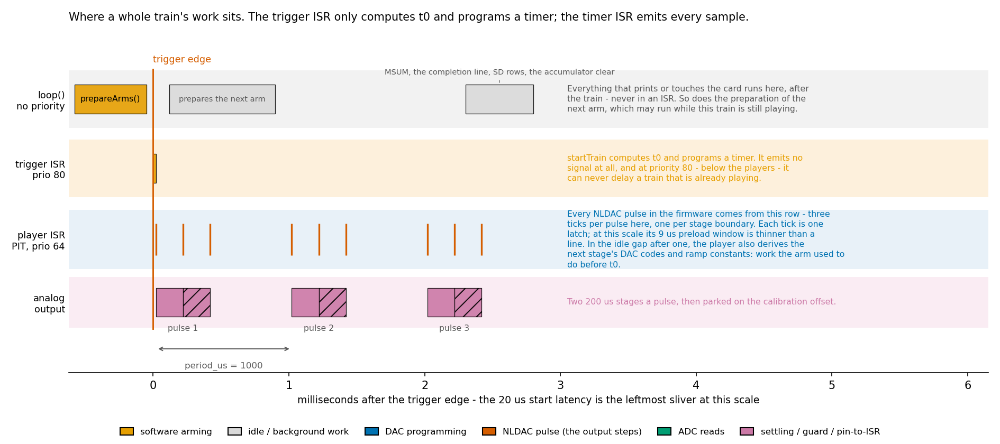

# stimjimAWG latency and timing

This document answers, in one place, how long `stimjimAWG` takes to put signal on the output
after a trigger edge, why that number is what it is, how it compares with the original
`stimjimPulser` firmware, whether the DAC can be preloaded to fire faster, what the trigger
interrupt actually starts, whether waveform generation occupies the CPU, and what SD logging
costs and stores. The short answers: a trigger edge delivers the first latch a fixed **20 µs**
later on a Teensy 3.5 with the register backends (`CAL STARTLAT`, adjustable without a rebuild,
and 20 rather than the compiled default of 35 because phase 14's pre-arm made it reachable),
of which the arm is now a small part — `loop()` prepares the whole of it into the engine's spare
player before the edge, leaving the edge ISR to place `t0`, attach the plan, swap the player and
program the timer — and none of which is the DAC write; the original firmware had no fixed
figure at all, because it played the first pulse inside the trigger ISR after two USB
`Serial.print` calls; the AD5752 *can* hold a preloaded code and fire on a bare `NLDAC` pulse in
0.44 µs, so a trigger path that also preloads the code could reach a few microseconds, which is
now one step away rather than a redesign; the edge ISR only computes `t0` and programs a timer, and every
sample is emitted from the timer ISR; generation is interrupt-driven with a bounded spin of a few
microseconds per event, not a busy loop; and an SD write can never delay a waveform, because only
`loop()` touches the card and the player ISRs preempt it.

## 0. Terminology: what "latch" means here

A **latch** is one DAC output update. The AD5752 keeps a written value in its input register and
does nothing with it until the `NLDAC` pin is pulsed low, which transfers the value to the DAC
register and moves the output. Analog Devices names that pin "load DAC", so **update** and **load**
are the neutral synonyms; the word carries no sense of a software lock or mutex. This document uses
"latch" for the event itself — the instant the output moves — and "update" wherever "latch" would
read as locking. The engine's whole timing design rests on the two halves being separable: it
*programs* (SPI write) during a preload window and *latches* (one `NLDAC` pulse, 0.44 µs) exactly
on the deadline.

## 1. Trigger-to-output latency

A trigger start delivers its first DAC latch at

```
t0 = <edge timestamp> − CAL TRIGCOMP + CAL STARTLAT + <slot delay_us>
```


`STARTLAT` is **20 µs** and `TRIGCOMP` **2 µs** on the Teensy 3.5 in hand, set and persisted on
2026-09-08. The *compiled* defaults are still 35 and 0 (120 µs on the portable build); these are
runtime state, so `CAL,STARTLAT,<us>` changes them, `P` persists them into the EEPROM image, and
`CAL?` reports what a running board uses. A board that already has an image keeps what it stored,
so a second board adopts these with `CAL,STARTLAT,20`, `CAL,TRIGCOMP,2` and `P` — after
re-measuring, because `TRIGCOMP` is a property of the board and not a constant to copy.

20 µs is what phase 014's pre-arm made reachable, and it puts the whole start latency inside one
default 20 µs ramp sample interval. Measured on silicon with real trigger edges
(`tests/device/startlat_trig.py`):

| route | arm | floor the firmware names | 20 µs? |
|---|---|---|---|
| joint (`TRIG<n>,1,…`), one engine | 6.0 µs, any shape | 17 µs | yes, 3 µs of margin |
| independent (`TRIG<n>,2,…`), two engines from one edge | twice that | **35 µs** | **no** |

The delivered edge-to-output latency that buys is **20.26 µs** (sd 41 ns), measured from the input
pin crossing its own switching threshold — see [bench-wiring.md](bench-wiring.md) configuration B.

**An independent route no longer fits.** It arms two engines from one edge, so it needs
`CAL,STARTLAT,30` or more; below that its first latch is late and the completion says so by name.
Nothing else changes — the warning is per train, not a refusal — but a bench that routes two slots
independently from one input has to raise `STARTLAT` back up, and thereby give up the sample-aligned
start latency. A single train driving both channels is the construct that keeps both, and is
already the right one for sample-aligned stimulation for the separate reason that independent
routes contend for every coincident latch (§ the 7.39 µs figure configuration C measures).

The latency is deterministic because the edge ISR timestamps the edge in its own first
instruction, and everything it then does is spent *inside* `STARTLAT` rather than added after it.
What has to fit in the window:

| Term | Cost (T3.5, register backends) |
|---|---|
| `Engine::startTrain` — what is left of the arm after the edge | Two `cycles64()` reads, `t0` and the envelope's four anchors, the plan attach, the player swap and one `pitProgram`, on a train of any shape. The rest — geometry, copy-on-arm, stage 0, the scalars, the envelope's reciprocals — is prepared in `loop()` by `Engine::prepareArms` (§7 item 9). The cold path, taken when the prepared player describes another slot, still costs the 9.0–20.0 µs §7 tabulates |
| `CAL PRELOAD` — how early the player ISR wakes before the first latch | 4 µs |
| `CAL DACPROG2` — the dual-channel SPI write inside that window | 5 µs budgeted (2.75 µs measured) |
| `SJ_MIN_SCHEDULE_US` | 3 µs |
| `CAL TRIGCOMP` — because it moves `t0` earlier, out of this same window | 2 µs |

So `STARTLAT ≥ arm + 12 µs + TRIGCOMP`, which on this board is 6 + 12 + 2 = 20. The arm used to
be the term that sized it; since the preparation moved to `loop()`, **the 12 µs floor is what
sizes it** — a preload plus a dual-channel program plus the scheduler's minimum, none of which any
scheduling change can remove (§3 is the only route below it, and its last step is not built). The
arithmetic is about 3 µs conservative: the firmware's own verdict under real trigger edges breaks
at 17, not 20. When an arm does not fit, the train still runs with a late first latch, and its
completion names the `STARTLAT` that would have covered it.

**The compiled default is still 35, because a start latency is measured and not derived.**
`SJ_START_LATENCY_US` carries the phase-13 figure for the arm this firmware no longer performs on
the prepared path; the board in hand runs 20 from its EEPROM image. To adopt what the preparation
buys on another board: run `python tests/device/bench_arm.py COM4`, read the *warmed* column, then
`CAL,STARTLAT,<warmed arm + PRELOAD + DACPROG2 + TRIGCOMP>` (never below 12) and `P`. Qualify the
value with `tests/device/startlat_trig.py`, which needs real trigger edges — a `T`/`U` start is
not charged for the arm and passes every candidate.

Two cases still pay more than the warmed arm, and both were measured at 20 µs:

- **An independent `TRIG` route** arms two engines inside one ISR and pays the remainder twice. It
  does not fit 20: the firmware asks for **35 µs**, and 30 passes. This is the case that decides
  whether a bench can use 20 at all.
- **A start whose prepared player describes something else** — `loop()` starved, or the slot edited
  since it last ran — falls back to the cold arm, the 9.0–20.0 µs §7 tabulates. A train has to
  *finish* before its engine can be re-armed, so `loop()` starved for a whole train is what that
  takes, not merely a fast trigger.

Jitter, not latency, is what the design buys: residual latch jitter is **42 ns** (`BENCHPIT` with
a preload), and the per-slot delay is exact to the scope's own sample interval (2000 µs set →
1999.3 µs measured, 20000 → 19996.0).

Two qualifications on the 20 µs:

- **`CAL TRIGCOMP` is 2 µs, measured.** The hardware delay between the pin edge and the output
  moving is 2.27 µs on this board: the pin-to-ISR delay *plus* the PIT wake and its 0.8 µs quantum
  *plus* the AD5752's latch-to-output delay. A scope on the trigger input and one output sees only
  their sum, and `NLDAC` is not brought out to separate them. `CAL` takes whole microseconds, so 2
  is set and 0.26 µs is left over — which is why the delivered latency is 20.26 and not 20.00.
  **It is subtracted on the trigger path only**, while two of its three terms apply to a `T`/`U`
  start as well, so a triggered train's output now leads a software-started one by about 2 µs.
  That is the intended trade: it buys an absolute, repeatable edge-to-output latency. See
  [bench-wiring.md](bench-wiring.md) configuration B.
- **The analog path adds its own 8–9 µs.** After a latch the output needs that long to reach its
  final value (`BENCHSETTLE`), so the load sees the onset at `STARTLAT` and full amplitude 8–9 µs
  later. No scheduling change can shorten that.

An independent two-engine route is additionally limited by latch contention: both player ISRs run
at priority 64, so the second waits for the first and lands **7.3 µs** later by the firmware's own
counter and **7.39 µs** at the output ([bench-wiring.md](bench-wiring.md) C1, against a control
that separates the two latches by 20 µs and reads 0.06 µs). It costs the same at every coincident
latch, not only at the first one after the arm. Two channels that must be sample-aligned belong in one train that
drives both, where a single `dacProgramBoth` and a single latch pulse serve both.

## 2. Comparison with the original `stimjimPulser`

The original firmware has no fixed trigger latency, because its trigger ISR plays the first pulse
itself. `startIT0ViaInputTrigger` → `startIT0` runs, in this order: two 80-byte `memset`s of the
measurement history, `micros()`, `IntervalTimer::begin(pulse0, period)`, **`Serial.print` plus
`Serial.println` of "Started T train with parameters of PulseTrain \<n\>"**, the LED and marker
GPIO writes, and only then `pulse0()`, which converts amplitudes with float divisions and writes
the DACs (`stimjimPulser/stimjimPulser.ino:663-726`). The comment on that call says why it is
there — `//intervalTimer starts with delay - we want to start with pulse!` — an `IntervalTimer`
fires its first callback one whole period after `begin()`, which would have delayed the first
pulse by the inter-pulse interval.

The consequences are structural rather than tunable:

- **The USB print is in the latency path.** A buffered CDC write costs microseconds; a write that
  finds the transmit buffer full blocks until the host drains it, which is milliseconds. The
  delivered latency therefore depends on whether a host is listening and how promptly.
- **Nothing is compensated.** The arm's cost is *added* to the onset, not subtracted from a
  budget, so it varies with train complexity and there is no constant to correct for.
- **The first pulse can be preempted by its own repeat.** The pin ISR runs at the core default
  priority while the repeat `IntervalTimer` runs at 64.
- **Desk arithmetic, not a measurement:** the non-print terms sum to roughly 10 µs, so the best
  case is under the 20 µs of `stimjimAWG` and the worst case is unbounded. `stimjimPulser`'s own
  absolute edge-to-output latency has never been measured; `stimjimAWG`'s has (20.26 µs, §1), and
  the same bench would measure the other for a direct comparison.

`stimjimAWG` differs by construction: no ISR ever prints (completions go through a ring and
`loop()` prints them), `t0` is anchored to the edge timestamp so the arm is subtracted rather than
added, the first latch always happens in the player ISR, and the trigger ISR sits at priority 80
*below* the players, so a trigger can never delay a waveform already playing.

The original was quick to its first pulse for one structural reason and not because it computed
less: `startIT0` called `pulse0()`, so the pulse was latched *inside* the trigger ISR. That is the
right idea, and §7 item 9 takes it — the difference is that the conversion now happens before the
edge instead of after it, which is what the original could not do and what makes the result a
constant rather than a variable. The remaining gap to the original's best case is the 12 µs
scheduling floor of §1, which §3's last step is the only route below.

**A serial `T`/`U` start has no comparable figure, and deliberately carries none:** the command's
arrival is quantized to the 1 ms USB frame and batched by the host driver on top of that, and it
then waits for `Protocol::poll()` in a `loop()` pass that may be flushing the SD card, so a start
requested over the serial port is repeatable to milliseconds at best. `startTrain` reflects that by
reading its own clock at the *end* when no anchor is passed: a `T` start means "first latch one
`STARTLAT` from now" and is never charged for the arm. Everything *inside* such a train is still
exact from `t0` — the pulse grid, the envelope, the measurement instants — and the completion and
`MSUM` timestamps report the `t0` it actually got. A start that has to land at a known instant
belongs on a trigger edge, or on a slot `delay_us` long enough to swallow the jitter.

## 3. Can values be preloaded into the DAC to fire faster?

Yes in hardware, and the firmware already relies on the mechanism for every latch. The AD5752
separates *program* (a 24-bit SPI write into the input register) from *execute* (an `NLDAC`
pulse), so `FastIO::dacProgram` and `FastIO::dacLatch` are two independent operations, and
`dacLatch` costs **0.44 µs** measured. A code written into the input register stays there
indefinitely until something overwrites it.

What prevents the trigger path from exploiting that is no longer the arm. Half of what this section
used to describe as unbuilt is now the normal path: `Engine::prepareArms` moves the whole arm
before the edge (§7 item 9), so the code the first latch needs is known in advance. What remains is
the *scheduling* of that latch — the player wakes `PRELOAD` early, programs the DAC and spins to
the deadline, which is the 12 µs floor of §1.

Going below it means writing the first sample into the input register *before* the edge and letting
the edge ISR pulse `NLDAC` itself, leaving three cheap steps: the pulse, the two GPIO writes that
switch the output enable from ground to the channel's mode, and a `pitProgram` for the second
event. That is an estimated **1–3 µs** delivered latency, dominated by interrupt entry and the
port-ISR dispatch. It is not built and not measured.

The costs of that last step, which is why it is still an open item:

- The preloaded input register would have to be rewritten after anything else that touches the
  DAC: `V`, `A`, `B`, `C`, `READ`, and the park write at train end.
- A trigger that never arrives leaves the board holding a charged input register. That is harmless
  — the output stays grounded and unlatched — but it is state that has to be tracked.
- The preload has to be redone whenever the preparation is, which is every slot edit and every
  `CAL` change. The epoch tag that already drives the preparation is the hook for it, so nothing
  else new is needed — which is why the remaining step is a step and not a redesign.

**Which waveforms it would actually help.** The first sample of *every* type is known before the
edge, because it comes from stored parameters and not from the trigger time, so preloading is
technically possible for `S`, `L` and `W` alike. It buys a visibly earlier onset only where that
first sample is a discontinuous jump away from the parked level: a rectangular `S` stage, an `L`
train whose first stage has 0 duration (an instant jump), or a `W` sine whose start phase has a
nonzero sine. A plain `L` ramp starts *at* the park level and a `W` at phase 0 starts at zero
amplitude, so their first latch changes nothing at the output; moving it earlier shifts the
timebase, not the onset. In that practical sense, the expectation that this matters for square
waves is right, with those two extensions.

The ceiling stands regardless: the output needs a further 1.9 µs after the latch to reach 90 % of
an 8 V step (measured on a scope; the 8–9 µs `BENCHSETTLE` reports is mostly the ADC read path, not
the output), so a pre-armed path would move the onset from the present 20 µs to a few µs without
sharpening the rise.

## 4. What the trigger interrupt starts

The edge ISR emits no signal. It timestamps the edge, arms the player (copy-on-arm plus all
fixed-point precomputation), computes `t0`, and programs that player's PIT channel to wake
`CAL PRELOAD` before `t0`. The first DAC latch — like every later one — happens in the PIT player
ISR. **The interrupt supplies the time reference; the clock emits the samples.**



This is deliberate, and it removes the original firmware's first-pulse-in-caller-context behaviour
by construction:

- the delivered latency is a constant that does not depend on the train's complexity, on how busy
  `loop()` is, or on how long interrupt entry took;
- the trigger ISR (priority 80) is below the players (64), so an edge can never delay a waveform
  already playing, and a first pulse can never be preempted by its own repeat;
- both engines started by one edge share that edge's timestamp as their `t0`, so they sit on one
  grid (engine-to-engine offset −0.25 µs, against −7.5 µs when each engine anchored on its own
  arm).

## 5. Busy loop or interrupts?

Interrupt-driven, with a bounded spin of a few microseconds per event. One latch costs:

```
PIT wakes CAL PRELOAD (4 µs) early
  → dacProgram / dacProgramBoth (1.4 / 2.75 µs measured)
  → spin on cycles64() to the exact deadline
  → NLDAC pulse (0.44 µs)
```

Between events the PIT is armed and the CPU is in `loop()` running serial, SD and display work —
it is not spinning. The CPU cost per event is about `PRELOAD + program ≈ 7 µs` with both channels
driven, so a 20 µs event grid (the default `DT`, and a 50 kHz sine) runs at roughly a third duty
cycle, and the 10 µs grid of a 100 kHz sine — the measured `SJ_FS_MAX_HZ` — at about two thirds.

Two places where the ISR stays in and spins longer:

- events within `PRELOAD + MIN_SCHEDULE` (7 µs) of each other are handled inline in the same ISR
  pass rather than re-entering the NVIC — 0-duration jump chains and dense sample grids become one
  continuous busy stretch;
- a measurement point spins to its instant before reading the ADC, because the reading has to be
  taken where the plan placed it.

Gaps longer than `SJ_MAX_SLICE_US` (10 s) are chunked into intermediate wakeups: the PIT cannot be
loaded with more, and the wakeups keep the 64-bit `CYCCNT` extension alive.

The original firmware is the opposite: `pulse()` busy-waits each stage with `delayMicroseconds`,
subtracting hand-calibrated DAC and ADC costs (2.75 µs and 4.5 µs) from the requested duration,
and the sine generator polls `micros()`. The CPU is occupied for the whole pulse, in ISR context,
and each stage boundary carries the accumulated error of its predecessors.

## 6. SD logging: latency and content

**Latency: none that a waveform can see.** No write ever happens in ISR context. The player ISR
pushes a fixed-size record into a 128-entry single-producer/single-consumer ring; `loop()` formats
it and hands it to SdFat, which buffers into a 512-byte block. A physical SDIO write happens at a
block boundary, at train end, every 64 rows, or once a second, whichever comes first. Because the
player ISRs (priority 64) preempt `loop()` unconditionally, and the card is on the Teensy's native
SDIO rather than the DAC/ADC SPI bus, a card write cannot delay a latch, lengthen a pulse, or take
the bus lock.

What card latency *can* cost is measurement records. SD write latency is dominated by the card's
own controller: `BENCHSD` on this board and this card measures 56 us for the average row and
**4.1 ms for the worst**, the latter being internal housekeeping during a flush. The worst case is
the number that matters, because it is what empties the MDATA ring rather than the average, and a
cheap card can stall for hundreds of milliseconds where this one stalls for four.

The exposure is the ring's headroom — a stall costs records once it exceeds
`128 / (measurement points per second)`, which is 64 ms at 2 000 rows/s, so a 4 ms stall costs
nothing and a hundred-millisecond one would. An overflow is never silent; it prints

```
WARN MEAS: MDATA ring overflowed — <n> records dropped (the host is not reading fast enough)
```

Two card operations do block `loop()` for a long time: `SDINFO,1` walks the whole free-cluster
chain (seconds, and it is refused while a train runs), and `SDGET` streams a file over the serial
port. Neither disturbs a waveform, for the reason above.

**The write path, measured end to end.** `BENCHFMT,<n>` times the per-row work `Measure::poll()`
does @EM@ four field conversions plus the row @EM@ with no serial write and no card. `BENCHSD,<rows>`
times what follows it: SdFat's buffered `println` plus the flush policy `SdLog::poll()` applies,
driven exactly as `loop()` drives it. Teensy 3.5 at 120 MHz, register backends, n = 2000, a 46-byte
row:

| Stage | min / avg / max | Rows per second |
|---|---|---|
| `BENCHFMT`, 0.7.0: `snprintf("%.2f")` per field | 285.8 / 336.7 / 350.1 µs | 2 970 |
| `BENCHFMT`, fixed point but still `snprintf` | 160.9 / 171.1 / 180.2 µs | 5 850 |
| `BENCHFMT`, fixed point + hand-rolled decimals | **10.0 / 11.7 / 13.9 µs** | 85 000 |
| `BENCHSD`, the card after it | 9.9 / 56.4 / 4 140 µs | 17 254 |

So a log row costs about **68 µs** end to end and the card is now the dominant term, which is where
the cost belongs. It was 393 µs in 0.7.0.

**What the two steps actually bought, and what they teach.** The first step took the four `%f`
conversions out. The Teensy 3.5 links full newlib (`teensy35.build.flags.libs` carries no
`nano.specs`), so `%f` went through `_dtoa_r`: double software arithmetic plus a `_Bigint`
allocation, four times per row. That saved 166 µs, about 41 µs per field. It did *not* leave "a few
microseconds per field" as expected, because what remained was newlib's `vfprintf` machinery
itself, entered five times per row at roughly 34 µs a call. The second step replaced those five
calls with three integer appenders (`putU32`, `putU64`, `putCenti`) and took the row from 171 µs to
11.7 µs. The output bytes are unchanged; `tests/host/test_measure.cpp` checks each appender against
the `printf` conversion it replaced, exhaustively over the ranges they can see.

The general lesson for this firmware: **on this libc `snprintf` costs tens of microseconds a call
whatever the conversion**, so any per-event formatting is worth doing by hand. The `MSUM` mean takes
the same fixed-point path from the integer sums; only the spread still multiplies in floating point,
because it comes out of a `sqrt`.

**The card's worst case is the number that matters.** 4.1 ms for a single row, against 56 µs
average: that is the card's internal housekeeping during a flush, and it is what empties the MDATA
ring rather than the average. 128 records is 64 ms of headroom at 2 000 rows/s, so a single stall of
this size costs nothing; a hundred-millisecond stall on a cheap card would.

**Floating point: where it is, and why none of it is worth changing.** The Cortex-M4F on a Teensy
3.5 has a *single*-precision FPU, so `float` is hardware and `double` is a software library. A
disassembly audit of the linked image (which functions call `__aeabi_d*`, `_dtoa_r`, `sqrt`) says:

- **nothing in the row path, the player ISRs, the arm, or `Measure::fire` touches floating point at
  all.** The waveform and logging paths are integer end to end, so there is nothing for single
  precision to speed up.
- What remains is `Measure::accumStats`, `printSummary`, `resultSnapshot`, `noteOffsets`,
  `SampleGen::sineDerive` and the human `printf`s in `Commands`. Every one of them runs once per
  train, per command or per slot definition @EM@ never per row, per sample or per latch.
- `accumStats` **must** stay double. Its variance is `sumsq - sum*sum/n`; at 500 repetitions
  `sum*sum` is around 1.7e13, and a 24-bit float mantissa carries an absolute error near 1e6 on a
  difference that can itself be 1e4. That is catastrophic cancellation, and it is exactly the
  "losing important digits" case. The means and spreads it feeds are also close to float's ~7
  significant digits, which a `%.2f` of a five-digit millivolt value would expose.

So the answer is that single precision has nothing to gain here and something to lose. The speedup
available in this firmware is integer formatting, and it has now been taken.

**The clock hierarchy, and the one rule that keeps it working.** Three clocks, three jobs:

- **The cycle counter is the only fine clock.** `FastIO::cycles64()` extends the Cortex-M DWT
  counter to 64 bits: 8.33 ns per tick at 120 MHz, an exact integer count per microsecond, and the
  source of every waveform instant, every measurement deadline and the log's `timestamp_us`.
- **It cannot overflow in service** — 2^64 cycles is about 4900 years — **but the software
  extension has a deadline.** It detects a 32-bit wrap by comparing against the previous reading,
  so something must call it at least once every 2^32 cycles = **35.8 s**, or a wrap is missed and
  the timestamp jumps back by that much. `loop()` guarantees it through `Engine::poll()`, and the
  long-running card and serial loops (`SdLog::list`, `SdLog::get`, `Measure::poll`) call it
  explicitly for exactly this reason. This is the one way the microsecond column can go wrong.
- **The RTC is a coarse label.** 32768 Hz, uncompensated crystal, and an epoch that is a compile
  time until a host sets it. It never touches a waveform. See `CLK` in
  [serial-protocol.md](serial-protocol.md) §4 and the RTC differences in
  [hardware-variants.md](hardware-variants.md).
- **The anchor ties them together.** `CLK?` reads the RTC and the cycle counter back to back; the
  log writes the same pair as `# clock:` lines at file open, before each train and at most once a
  minute while rows are written. A row's wall clock is its `us` mapped through the nearest anchor.

**Content.** Log files are `LOG0000.CSV` upwards — the lowest free index, never reused — or a
name given to `LOG1,<name>`. The index and not the clock is what identifies a run, because the RTC
epoch may be a compile time. A file contains, in order:

1. written when the file is opened: a header line (`# stimjimAWG log — fw=…, proto=…`), the `IDN`
   identity block, and the whole session configuration as the paste-back-able lines `DUMP` prints
   (every slot's canonical `S`/`L`/`W` line, `ENV`, `MEAS`, the `TRIG` table and the `CAL` timing
   budget, so the budget the readings were taken with is recorded next to them);
2. a `# columns: timestamp_us,slot,pulse,point,V0_mV,I0_uA,V1_mV,I1_uA` line;
3. a `# train:` block for every train that arms while the file is open — that slot's canonical
   waveform line, its `ENV` line if non-default, and its `MEAS` line. This is what records
   configuration changes made after the file was opened, and what keeps a log self-describing when
   trains were fired by trigger edges with no host attached;
4. `# clock: <ISO 8601> src=<build|batt|host> us=<since boot>` anchor lines, at file open, before
   every `# train:` block and at most once a minute while rows are being written. The CSV columns
   carry no wall clock; a row's `us` maps through the nearest anchor above it, and the drift
   between two anchors is visible in the file rather than hidden inside it;
5. one CSV row per measurement repetition, for slots whose `MEAS` `report` has bit 1 set (`+2`):
   `<timestamp_us>,<slot>,<pulse>,<point>,<V0_mV>,<I0_uA>,<V1_mV>,<I1_uA>`, timestamp in µs since
   boot. Lines that were not read are empty fields.

Files this firmware creates also carry a real FAT modification timestamp, but only when the clock
source is not `build`: a wrong file date is worse than none, because a host sorting by date would
believe it.

Nothing else goes to the card. Output samples are not dumped, and the persistent configuration
lives in the EEPROM, not on the card. The socket sits under the instrument cover, so the whole
card is readable back over the serial port with the `SD` group — see
[serial-protocol.md](serial-protocol.md) §4.


## 7. Where the arm's microseconds go

`STARTLAT` is the trigger latency and the arm used to be what sized it, so this section accounts
for the arm. It is kept because the arm is still what a *cold* start pays and what `BENCHARM`
measures, but the goal it was written against — an arm inside one latch interval, meaning 8 µs
once `PRELOAD + DACPROG2 + MIN_SCHEDULE` = 12 µs is subtracted from a 20 µs interval — was retired
against a 9.0 µs floor and then made moot: item 9 below moves the arm out of the edge path
altogether, so what `STARTLAT` covers on a prepared start is the 12 µs floor plus a few
microseconds.

What the arm produces, in the order it runs: gatekeeping (busy and channel-conflict checks, the
Nyquist and ramp-interval refusals, a copy of the `CAL` set); copy-on-arm of the definition into
the 912-byte player state, which is what keeps live serial editing safe mid-train; unit conversion
of every stage amplitude to a DAC-code delta relative to the park code and every duration to a
cumulative cycle offset, so the ISR does no unit math; the shape-specific constants (`L` Bresenham
steps per stage, `W` sample rate and phase increments, the envelope's reciprocals); the
measurement plan; and finally `t0` plus one timer program.

All of it now runs in `loop()` on the prepared path (item 9); what follows is why it could be
moved at all. Of all that, only the train-level scalars and **one stage's worth** of codes and
times are needed at `t0`. Stage i's constants are first read at the end of stage i−1 — 20 µs to seconds later — and
the measurement plan's first point cannot fire until at least `SETTLE` after the first latch. Both
observations have since been acted on, which is why the table below barely varies with either
stage count or plan size.

### Measured

`BENCHARM` on a Teensy 3.5 at 120 MHz (120 cycles/µs), register backends, `hot=RAM`, via
`tests/device/bench_arm.py`. Three columns, because the arm has three regimes:

- **warmed** — one arm per `loop()` pass, which is what a running board delivers. `loop()`
  prepares the whole arm into the spare player, compiles the next measurement plan and clears the
  last train's accumulators before the edge arrives (`Engine::prepareArms`), so none of that shows
  up here. **The figures in this column predate item 9**, which empties it further; they are the
  cost of the arm as phase 13 left it, and re-measuring them is what lowers `CAL STARTLAT`.
- **typical** — the minimum over `--reps` arms run back to back inside one bus lock.
- **worst** — the maximum over the same run: an engine re-triggered before `loop()` could prepare
  anything. This is the fallback path, and the only one that still builds a plan inside the arm.

| Case | warmed, µs | typical, µs | worst, µs |
|---|---|---|---|
| undriven, 0 stages | 9.04 | 9.04 | 9.50 |
| `S`, 1 ch, 1 stage | 10.79 | 10.79 | 11.29 |
| `S`, 2 ch, 1 stage | 11.12 | 11.33 | 11.58 |
| `S`, 2 ch, 1 stage, `MEAS` V+I both | 11.12 | 11.12 | 12.83 |
| `S`, 2 ch, 10 stages | 13.29 | 13.29 | 13.79 |
| `S`, 2 ch, 10 stages, `MEAS` V+I on every stage | 13.29 | 13.29 | 19.96 |
| `L`, 2 ch, 1 stage | 12.17 | 12.38 | 12.62 |
| `L`, 2 ch, 10 stages | 15.00 | 15.00 | 15.54 |
| `W`, 2 ch | 10.96 | 10.96 | 11.50 |

Read the third and fourth rows together, and the fifth and sixth: **in-train measurement costs the
arm nothing at all**, whether the plan has one point or ten. Read the third against the fifth and
the seventh against the eighth: **nine extra stages cost 2.2 µs on an `S` train and 2.8 µs on an
`L` one**, where they used to cost 8.0 and 17.4. What a train costs the arm is now:

| Term | Cost | What it is |
|---|---|---|
| floor | 9.04 µs | gatekeeping, the `CAL` copy, the geometry, the train-level scalars, `envInit`, `t0`, one `pitProgram` |
| stage 0 | 0.6 µs (`S`) / 1.6 µs (`L`) | the one stage whose values are due at `t0` — two amplitude conversions and, for `L`, `rampStageInit` |
| per further stage | 0.25 µs (`S`) / 0.31 µs (`L`) | one 64-bit `dur_us × 120` into `cum[]` and, for `L`, the sample-count division `rampStageN`. Both feed the measurement plan, so they cannot be deferred the way the rest of a stage can |
| per measurement point | 0 | compiled and cleared in `loop()`. 0.55 µs to clear, and 3.1 µs more to compile, only when an engine is re-triggered before `loop()` ran |

The table above is the *cold* arm, which is what the compiled default of 35 µs was set from: the
worst warmed arm of phase 13 — a ten-stage `L` train's 15.0 µs — needed 24, and the worst cold arm
— an engine re-triggered with `loop()` starved, compiling its own ten-point plan — is 19.96 µs and
needs 29; 35 covered both.

Item 9 changed the warmed figure and left the cold one alone. Re-measured on silicon after phase
14, `bench_arm.py`'s warmed column is **5.92–6.00 µs for every shape** — flat in stage count, flat
in whether the train is measured, which is what "the preparation is done in `loop()`" means when it
works. That puts the joint-route floor at 6.0 + `PRELOAD` + `DACPROG2` + 3 + `TRIGCOMP` = 20 µs by
arithmetic and at **17 µs** by the firmware's own verdict under real trigger edges, and the board
now runs `CAL STARTLAT` = 20 (§1). What did *not* improve is the independent route, which arms
twice and still asks for 35.

**The 8 µs target is not reachable by removing work from the arm, and the floor was reviewed term
by term to establish that.** 9.04 µs at 120 MHz is 1085 cycles over roughly 150–250 instructions —
the busy check, a `Cal::live()` copy, `buildGeometry`, the conflict check, twenty-odd `Player`
stores, `Measure::armPlan`, a dozen counter resets, `envInit`, `t0`, two LED writes and
`pitProgram`. That is 4–7 cycles an instruction, which is what a Cortex-M4 costs when the work is
64-bit `SJ_US_TO_CYC` multiplies, struct copies through memory, and five PIT register writes across
a 60 MHz peripheral bus. There is no single fat term left; there are ten thin ones, and no
instruction-level measurement would change the conclusion. Getting under one latch interval needed
the arm moved *before* the edge — which item 9 does.

### Where the arm no longer spends anything

Nine changes took the arm from the 16.2–37.5 µs it once cost to the table above and then out of
the trigger path altogether. All of them move work out of the arm rather than making it faster.

1. **The measurement plan is compiled in `loop()`, not in the arm.** The compiled region depends
   only on `(slot, definition, CAL)` — never on the calibration offsets — so it carries that tag,
   and `loop()` compiles it for whatever slot a `TRIG` route would start next, falling back to the
   last slot written for an engine no route names. That is worth 3.1 µs per measurement point,
   which was the largest single term in the arm.
2. **The accumulators are cleared in `loop()` too**, after the summary has been printed — 0.55 µs
   per point. No memory operation makes this free where it stood: 96 bytes is 24 SRAM words, the
   generic `memset` spends ~66 cycles on them, and a hand-rolled `STMIA` clear would only halve
   that. Moving it was the only way to reach zero.

   Both of those rest on one structural change: **each engine holds two plans**, and the arm swaps
   between them instead of rewriting one in place. The player ISR only ever reads the live buffer,
   so `loop()` owns the other and can prepare it with no lock — a `volatile` flag handshake covers
   the one window where a trigger edge lands inside a `loop()` compile, and the arm then rewrites
   the live buffer in place exactly as the single-buffer firmware did. It costs 2448 B of RAM, and
   it also means a train re-armed before `loop()` drained its completion keeps its summary, which a
   single plan could not.
3. **Only the plan a train uses is zeroed.** The compiled region is 242 bytes of the struct's 1224,
   and the accumulators are cleared per existing point (96 bytes each) instead of all ten. An
   unmeasured train zeroes nothing at all.
4. **The sine constants are derived when `W` is parsed.** `sampleCyc`, both phase increments and
   both start phases depend on the definition alone, so they are computed in command context and
   cached per slot (2 kB), keyed on the definition epoch. That is why a `W` arm now costs about
   what an `S` arm does — it was 18.3 µs more, nine soft-float `double` calls per channel in
   `sinePhaseInc`, which the M4F has no hardware for. The arm still derives on demand if the cache
   was invalidated, so correctness never depends on the warm-up — only the latency does.
5. **The ramp's time-axis division is 32-bit.** `qt = durCyc/N` and `rt = durCyc%N` are computed as
   `qt = (dur_us/N)·cycPerUs + ((dur_us%N)·cycPerUs)/N`, `rt = ((dur_us%N)·cycPerUs)%N`, which is
   an algebraic identity, not an approximation: four hardware `UDIV`s replace two
   `__aeabi_uldivmod` calls with bit-identical results. Stages longer than ~35 s fall back to the
   64-bit form, and `tests/host/test_samplegen.cpp` checks both paths against the 64-bit reference
   over the whole range including both overflow guards.
6. **`SJ_CODE_IN_RAM` (default on for Kinetis) puts `startTrain`, `buildGeometry`, `playerRun`,
   `rampStageInit` and `rampStep` in the `.fastrun` section**, which the core copies from flash
   into SRAM at boot, so they execute without flash wait states. It costs about 6.4 kB of RAM and
   nothing else — the copy is remade from the flash image on every reset, and the MCU's POR/LVD
   resets the chip long before SRAM contents could decay, so there is no failure mode here that the
   stack and globals do not already have. `IDN` reports `hot=RAM`, `hot=flash` or `hot=ITCM`
   (Teensy 4.x runs all code from RAM anyway), because a `BENCHARM` figure is only comparable
   against a binary with the same answer.
7. **`SampleGen::rampStageN` is a header inline, not a call.** It is the one piece of a ramp stage
   the measurement plan needs — the sample count — so both `buildGeometry` and `rampStageInit`
   compute it; as an out-of-line function it cost 0.35 µs per ramp stage, because `SJ_HOT` carries
   `noinline`, which is more than the division it wraps.
8. **Stage i+1 is derived while stage i plays.** The arm derives stage 0 — the one stage whose DAC
   codes are due at `t0` — and the player derives each later stage in the gap before a latch it is
   already waiting for. That takes 0.6 µs per `S` stage and 1.6 µs per `L` stage out of the arm and
   is what makes a ten-stage `L` train cost 15.0 µs instead of 28.7.

   The mechanism is one counter, `nDerived`: stages below it have their DAC-code deltas and, for a
   ramp, their Bresenham constants. `Engine::deriveAhead` tops it up on the one path in `playerRun`
   that programs the timer and returns — idle time by construction. `ensureDerived` at each use
   site is the guarantee, so correctness never depends on the look-ahead having run; the call sites
   sit *after* a latch, so a derivation that does fall back spends the interval to the next latch
   and never a preload window.

   **How far ahead it looks is decided by the definition, not by the clock.** It derives the stage
   due next and then keeps going while the stage it has just derived has 0 duration, because that
   is the one kind of stage that yields no gap of its own: its single sample shares a deadline with
   the previous stage's last one, so entering it hands the player no idle time and the stage behind
   it has to be ready already. That covers the `L` pair — a second 0-duration stage in a row is
   refused at parse time — and an `S` run of any length, which nothing refuses. The only clock
   reading left is the entry guard: do not start a derivation with less than
   `SJ_STAGE_DERIVE_US` left before the wake-up. The rule this replaced derived as many stages as
   the clock said would fit, which bought at most one derivation's worth of microseconds on a latch
   that cannot be on time anyway — the second latch of a coincident pair is late by definition,
   `playerRun` excludes such pairs from `overdueEvents`, and the 8–9 µs analog settling means the
   intermediate value never reaches the output.

   The player carries a 120-byte copy of the stage triplets for this (+336 B of RAM for the two
   engines), because it must not read `TrainStore` while a train runs: a slot write is refused only
   for the slot a train is *attached to*, and that check is made in `loop()` while a trigger edge
   can arm from an ISR. The conversion was rewritten to take the channel's park code as an argument
   instead of reading `Stimjim`'s offset tables, so nothing in the ISR path depends on live
   calibration state; the expression and therefore every DAC code is unchanged.

   **Measured on the board, not argued:** `tests/device/stage_timing.py` runs the six trains that
   stress the stage machinery — ten `S` stages a millisecond apart and twelve microseconds apart,
   ten `L` stages at the default 20 µs interval and at the 12 µs floor, an alternating 0-duration
   jump chain, and a measured ramp — and every one completes with `lateEvents` and `overdueEvents`
   both zero. The same script prints each case's `MSUM` rows, and they match the pre-change
   firmware to within 7.3 mV, against per-point standard deviations of 2–10 mV.

9. **The whole arm happens before the edge.** `Engine::prepareArms`, called every `loop()` pass,
   writes everything a start does not need the start *time* for into the engine's spare player: the
   geometry, the copy-on-arm of the stage triplets, stage 0's derivation, the period/duration/
   preload/delay scalars, the sine constants and amplitudes, every counter reset, and the
   envelope's two reciprocals. It prepares whichever slot a `TRIG` route would fire next, falling
   back to the last slot written for an engine no route names — the same choice `routedSlot` has
   made for the measurement plan since item 1.

   What the edge ISR then does is `t0`, four envelope anchors (`SampleGen::envRebase`, no
   division), a re-read of the two park codes, the plan attach, two LED writes, the player swap and
   one `pitProgram`. Two `cycles64()` reads and a few dozen instructions, on a train of any shape,
   which is why the independent-route case that needed ~39 µs no longer does.

   It rests on the same structure as items 1 and 2: **two players per engine**, +2.6 kB of RAM. The
   ISR only ever reads `*live[eng]`, so `loop()` owns `*warm[eng]` and can prepare it with no lock
   at all, even while a train plays; the arm swaps the two pointers and hands the buffer that has
   just played back to `loop()`. One flag carries the invariant: `armReady` is set only by
   `prepareArm` and cleared only by the arm that consumes the buffer, so a buffer that has ever
   played is never mistaken for a prepared one — its counters, `evIdx`, `evPhase`, `nDerived` and
   ramp cursor are all mid-train state.

   **A prepared arm does not freeze the definition.** The preparation carries the plan's tag —
   slot, `TrainStore::epoch()`, `Cal::epoch()` — and an edge whose prepared player fails it
   prepares one in place instead, paying what the arm used to. So a slot edited a microsecond
   before an edge still plays as edited, which is the property §3 listed as the price of
   pre-arming and which the tag buys back. The park codes are the one exception, because `A`/`B`/`C`
   are outside the tag: the arm re-reads them (two loads). Stage amplitudes need no such treatment
   — `ampToDelta` returns a delta the offset cancels out of, except at saturation, where a
   recalibration between the preparation and the edge can shift a code that was already out of
   range and WARNed at parse time.

   `BENCHARM` separates the two paths without any change to it: its repetitions run back to back
   inside one bus lock with no `loop()` pass between them, so they measure the cold path, and
   `bench_arm.py`'s warmed column — one arm per invocation — measures the prepared one. **That
   column is what a new `CAL STARTLAT` comes from, and it has not been re-measured on silicon
   since this change.**

**What RAM residency is actually worth, measured.** Building the phase-11 sources with
`-DSJ_CODE_IN_RAM=0` and running the same sweep. The absolute numbers predate the last two changes
above, so read the third column, not the first two:

| Case | `hot=RAM` | `hot=flash` | saved |
|---|---|---|---|
| undriven, 0 stages | 8.45 | 9.88 | 1.43 µs |
| `S`, 2 ch, 1 stage | 9.88 | 11.92 | 2.04 µs |
| `S`, 2 ch, 10 stages | 17.88 | 21.04 | 3.16 µs |
| `L`, 2 ch, 1 stage | 11.38 | 13.75 | 2.37 µs |
| `L`, 2 ch, 10 stages | 28.79 | 33.04 | 4.25 µs |
| `W`, 2 ch | 10.12 | 12.29 | 2.17 µs |

13–17 %, not the 30–50 % the flash-wait-state hypothesis implied. The distinction the numbers draw
is between a **large straight-line function** and a **small hot loop**: `startTrain` is 2.8 kB and
`playerRun` 3.2 kB, both far past the K64's 512-byte flash cache, and those are where the saving
comes from. Moving the 180-byte `rampStageInit` into RAM as well saved only 0.037 µs per ramp stage
(0.33 µs over ten) — the cache holds a loop that size perfectly well.

To build the flash-resident half of the A/B, pass the define through the property the Teensy
recipe actually reads — `compiler.cpp.extra_flags` is silently ignored here
([hardware-variants.md](hardware-variants.md) §1):

```
arduino-cli --config-file tmp/arduino-cli.yaml compile --fqbn teensy:avr:teensy35 \
  --build-property "build.flags.defs=-D__MK64FX512__ -DTEENSYDUINO=160 -DSJ_CODE_IN_RAM=0" \
  --warnings more stimjimAWG
```

### Planned, not implemented

Ordered by what the measurements say each is worth, largest first.

- **Move `cum[]` and the ramp's per-stage `N` out of the arm as well.** They are what is left of
  the per-stage cost — 0.25 µs per `S` stage and 0.31 µs per `L` one, so 2.8 µs on the worst train.
  They stay because `Engine::buildGeometry` is shared with the `loop()`-side plan warm, which needs
  both arrays whole and pays nothing for them there; making them lazy means splitting that function
  in two, and the plan tag's guarantee that a warmed plan describes the geometry the arm computes
  rests on there being exactly one copy of it.
- **Pre-arm the whole train and fire on a bare `NLDAC` pulse** (§3). This makes the arm's cost
  irrelevant rather than smaller, and is the only path to a single-digit *total* trigger latency —
  and, given the 9.0 µs floor, the only path to an arm inside one latch interval.
- **Separating the three delays `CAL TRIGCOMP` lumps together** — pin-to-ISR, PIT wake, DAC
  latch-to-output — needs a probe on `NLDAC`, which no connector carries. Until then a triggered
  start leads a `T`/`U` start by the 2 µs of compensation, because two of the three are common to
  both paths. [bench-wiring.md](bench-wiring.md) configuration B has the measurement.
- **An independent `TRIG` route does not fit `STARTLAT` = 20** and needs 30 µs or more; §1 has the
  measured floors.
